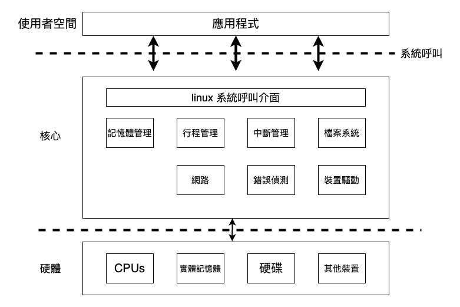

# Linux核心簡介

## 簡介

作業系統是硬體與應用程式之間溝通的橋樑，應用程式想要使用硬體，都需要有作業系統的協助。

<figure><figcaption>
Linux作業系統結構
</figcaption></figure>

### 行程管理(process management)&#x20;

行程(process)是linux中重要的概念，其中包含了選擇下一個要執行的程式，並且在切換運行程式的時候要進行上下文切換(context switch)，更甚至要在多個程式同時運行的狀況下，能夠正常運行。。

### 記憶體管理 (memory management)

為了讓使用者能更流暢更舒服的使用，記憶體管理牽涉到實體記憶體與虛擬記憶體，虛擬記憶體讓多個程式可以同時運行，讓程式實際的大小能比記憶體的大小更大。有頁面回收(page reclamation) 、分頁錯誤(page fault)、 記憶體共享(memory share)以侔選出要被替換的頁面(page)的問題。

### 中斷管理(interrupt management)&#x20;

中斷管理中包含例外(exception)，與中斷(interrupt)，例外包含程式錯誤例外、軟體產生例外、機械錯誤例外。 中斷則通常是外部設備透過中斷信號告知處理器，處理器會停下目前執行的指令處理中斷。在linux中提供了 softirq, tasklet 等等作法。

### 檔案系統 (file system)

Linux 核心為了統合各個檔案系統實作，引入一層虛擬檔案系統 ((Virtual File System, VFS)，後者是一組檔案操作的抽象介面，於是依循 VFS 界面開發的任何的檔案系統，可在執行時期掛載到 Linux 核心，在 FUSE (Filesystem in Userspace) 出現後，更給檔案系統開發者極大的彈性，能夠快速且多樣地延展作業系統的特徵。

## 參考資料

* [https://www.kernel.org/](https://www.kernel.org/)
