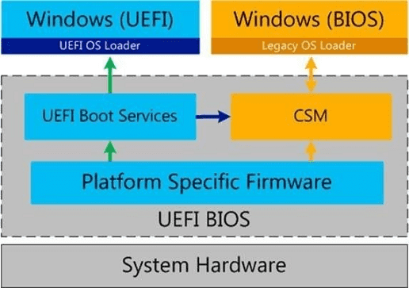

# UEFI

## 簡介

UEFI(Unified Extensible Firmware Interface)， 是一種詳細描述類型介面的標准。這種介面用於作業系統自動從預啟動的操作環境，加載到一種作業系統上。EFI (Extensible Firmware Interface）是 Intel 為 PC 韌體的體系結構、介面和服務提出的建議標准。其主要目的是為了提供一組在 OS 加載之前（啟動前）在所有平台上一致的、正確指定的啟動服務，被看做是有近20多年歷史的 BIOS 的繼任者。 UEFI是由EFI1.10為基礎發展起來的，它的所有者已不再是Intel，而是一個稱作Unified EFI Form的國際組織。

BIOS產業是科技和人力密集型企業。BIOS對熟練工程師需求相當大，因為BIOS對硬體的改變相當敏感，硬體小變需要小改，大變需要大改。

我們的計算機系統可以粗粗看作由三部分組成，分別是硬體、BIOS韌體和作業系統。一般的作業系統可以在所有的電腦上運行，這是因為BIOS抽象了硬體的不同，向上提供了統一的介面，這個介面就是UEFI標準。如此Windows和Linux可以用UEFI標準定義的介面統一個別硬體的差異，而不需要為每個硬體改變做出修改，開發出來的系統，賣一套和賣一億套成本差異很小，擴展性極大，也就是Scale Out能力很大。

<figure>
<figcaption>簡單的電腦組成結構</figcaption>
</figure>

BIOS和硬體的操作介面是硬體暫存器，BIOS工程師需要根據各種規範、原理圖和功能需求，填寫暫存器，最後抽象後向上匯報符合UEFI標准統一介面。而各個硬體的暫存器沒有標准，且同廠商的硬體下一代會修修結構，於是BIOS也要不停的修改，只為了讓操作系統保持優雅，可以說BIOS做了產業鏈裡面最累的事。

現在作業系統和BIOS之間的介面已經標准化，但BIOS和硬體介面卻遠遠沒有標准化，能不能把暫存器標准化？因為各種CPU硬體設計的巨大差異，暫存器的標准化似乎不太現實。

* UEFI：簡單來說就是改良版的BIOS，但UEFI不能稱為BIOS，在新的主機板看到圖形化介面，以及可以用滑鼠鍵盤操作的”BIOS”畫面，就是UEFI介面。很多人混淆的一點，沒有’UEFI BIOS’。不過為了方便說明與避免混淆，仍會習慣使用”BIOS”代稱，但請不要認為UEFI是某種BIOS。

<figure>
<figcaption>UEFI架構</figcaption>
</figure>

* .Boot:開機：硬碟剛買來時，硬碟裡面完全都是空的，也就是你不安裝作業系統的話，是沒辦法開機進去操作的。那如果你有兩顆硬碟時，在BIOS裡面，就可以選擇，我要從哪顆硬碟去啟動作業系統，即是所謂的開機選項，Boot Menu。
* 而如果想要UEFI啟動，就必須以UEFI模式安裝UEFI作業系統，但UEFI的開機選項不只有裝置順序，還有系統本身。

BIOS樣式的韌體只在IBM PC相容電腦上找的到。UEFI意味著更通用、更高效、更快速，並且可以在不屬於“IBM PC相容”類的系統上找到。

* UEFI採用PE/COFF格式作為UEFI驅動和應用的標准，而不是ELF格式。主因是微軟在UEFI體系中發揮了舉足輕重的作用，參與了大量標准的制定。
* &#x20;UEFI選擇FAT作為UEFI分區標准。
* UEFI核心代碼都是C語言寫的，不用C++。C寫內核與UEFI的原因，從來就不是C善於操作硬體，而是善於操作硬體的語言很多，c的復雜性恰到好處而已。其他善於操作硬體的語言寫硬體代碼反而大材小用。C++還有執行庫龐大與ABI沒有標準化的問題。

## CSM: Compatibility Support Module相容性支援模組

主機板改進到UEFI之後，那沒有支援UEFI的顯示卡，硬碟等等硬體怎麼辦呢?這時就需要CSM的出現，他是在UEFI淘汰掉BIOS中的過度功能，模擬傳統BIOS。

也就是說在UEFI架構下，透過CSM模擬BIOS來相容只支援BIOS開機的裝置。也稱為Legacy模式、LegacyMode、Legacy BIOS。所以如果要安裝純UEFI也就是將CSM給關閉(Disable)。如果你的電腦沒辦法關掉CSM，那就只能待在UEFI+CSM模式的半UEFI了。“CSM”有時會錯誤地將此功能稱為“禁用UEFI”，這在說法上是荒謬的。你無法“禁用”系統的韌體。

<figure>
<figcaption>CSM</figcaption>
</figure>

## Secure Boot 安全啟動

與UEFI不同。安全啟動的核心就是利用數字簽名來確認EFI驅動程序或者應用程序是否是受信任的。

“安全啟動”設計之初作用是防止惡意軟件侵入。事實上它能夠做到的僅僅是，當電腦啟動器被病毒修改之後，它會給出提醒並拒絕啟動，避免可能帶來的進一步損失。

Secure Boot要求原生UEFI環境，即不能開啟CSM，也就是開啟Secure Boot的系統不支援Legacy啟動及Legacy Option ROM。

## GOP與VBIOS

純UEFI介面(無CSM模擬BIOS的UEFI)，是由顯示卡(或內顯)的GOP來產生的。

而傳統BIOS就是用VBIOS產生的，所以，你的顯示卡如果較新，就會有GOP功能，才能以純UEFI啟動(關掉CSM)，那如果你是較舊的顯示卡，則會以CSM模擬BIOS再以顯示卡的VBIOS啟動。

## GPT與MBR比較

### 磁碟結構

<figure><figcaption>磁區(sector)，磁軌(track)，磁柱(cylinder)</figcaption>
</figure>

* 磁區：就是磁軌上的一段弧線。很多人以為一個磁區就是一個扇狀餅塊，其實不是而是磁軌的一段弧線而已。
* 磁軌：就是圍著主軸馬達的一個磁碟碟的一個圓，一片磁碟就是很多個磁軌組成，雖然有間隔但是我們可以忽略不計，一般讀取頭寫滿了一個磁柱上的磁軌就會跑到另一個磁柱的磁軌寫。**雖然內外磁軌的長度不一樣，但是每磁軌上的扇區數還是一樣的，就是說內圈密度大，外圈密度小**。
* 磁柱：因為有多個磁碟才有磁柱的出現，磁柱就是由多個磁軌(同一磁軌編號，但在不同磁碟上)的立體空間。

方便記憶的方法：磁碟上有很多磁柱，而磁柱上有很多磁軌，而磁軌上又有很多磁區。

**磁頭數量(可讀寫的表面) X 磁柱數量(其實是每個表面的磁軌) X 每條磁軌的磁區數量 X 每個磁區的容量 = 硬碟容量**

* 每個金屬磁片通常都有兩面﹐每一面都有其各自的讀寫磁頭(Head)一個，所以磁片數量並不是磁頭數量，而**磁頭數量一般是磁片數量的兩倍**。

### MBR

<figure>
<figcaption>MBR結構</figcaption>
</figure>

MBR是壹段資訊，存在磁碟的第壹個(編號0)磁區中，大小為512位元組。其作用為儲存引導程式碼，用於啟動作業系統；以及儲存磁碟分割槽資訊。

MBR結構可分為以下區塊：（1）0-445位元組，載入開機管理程式；（2）4x16=64位元組，分割槽表；（3）510-511位元組，AA55（magic number）。

分割槽表(partition)資料結構，16 位元組，記錄該分割區的起始與結束磁區(或磁柱)(連續的區間)：

* Status，1 bytes，分割槽狀態，是否可用於啟動；
* Start，3 bytes，在分割槽中起初的絕對磁區的CHS地址；
* Partition Type，1 byte，分割槽型別；
* End，3 bytes，在分割槽中最終的絕對磁區的CHS地址；
* LBA，4 bytes，在分割槽中起初的絕對磁區的LBA；
* Partition Length，4 bytes，在分割槽中的磁區數；

分割資訊可分為主要(Primary)分割槽、延伸(Extended)分割槽、邏輯(Logic)分割槽。主要分割槽+延伸分割槽最多只能有 4 個，而邏輯分割槽是在延伸槽裡面繼續分割，不限數量。

<figure>
<figcaption>主分割槽與邏輯分割槽</figcaption>
</figure>

* 主要分割與延伸分割最多可以有四筆
* 延伸分割最多只能有一個
* 延伸分割是一種概念，無法格式化
* 邏輯分割槽不能安裝作業軟體
* 邏輯分割理論上是可分割無限多個，但因作業軟體限制，有最大值。
* 最大支援到 2TiB

在MBR中，分割槽表的組織限制了一個磁碟最大可定址空間為「2TiB」。「MBR」不在分割槽中，它在第一個分割槽之前。

磁碟也可以沒有MBR。此時（1）磁碟是“整個分割槽”，不存在分割槽，因為分割槽資訊儲存在主引導記錄中。（2）只能用於儲存資料，無法安裝作業系統，因為載入程式儲存在主引導記錄中。

傳統BIOS只支援容量不超過2TB的驅動器，原因是：按照常見的512Byte扇區，其分割槽表的單個分割槽的第13-16位元組用來進行LBA定址，也就是以扇區(sector)為單位進行定址。

13-16總共4個位元組，1Byte=8bit，這樣也就是4\*8=32位元，總共就是 $$2^{32}$$個單位空間，以扇區為單位進行定址，每單位512Byte，也就是2 TB，所以傳統BIOS支援的最大容量的驅動器，不超過2TB。

$$
2^{32} \times 512B =2^{41}B =2\ TB
$$

### GPT

<figure>
<figcaption>MBR與GPT結構</figcaption>
</figure>

UEFI支援64位的位址空間，所以其定址偏移恰好為64位元，可支援到8ZB。按照硬體廠商1000：1024計算時為18EB。

$$
2^{64} \times 512B = 2^{73}B = 8\ ZB
$$

現在又由8個512Byte扇區偽裝一下，發展成了4k大小的扇區，所以上述計算還可以再乘8，即GPT最大分割槽容量可以是64ZB。

GPT，一種新型磁盤模式，與我們常用的MBR磁盤相比更穩定，自糾錯能力更強，一塊磁盤上主分區數量不受限制，硬碟可支援到18ET，可分割128磁區(128個C.D.E槽)。

MBR，主引導記錄，一種磁盤分區模式。硬碟支援到2TB，最多可分個4個主要磁區(4個C.D.E槽)。當使用2TB以上硬碟請用GPT模式，否則MBR只認2TB內容，其他皆會浪費掉。

* BIOS+MBR：可重啟系統，所有系統可支援，不支援大於2T的硬盤。
* BIOS+GPT：不可重啟系統，可以做資料碟使用，不可引導系統。
* UEFI+MBR：可重啟系統，同BIOS+MBR 。
* UEFI+GPT：可重啟系統，可使用大於2T硬盤作為系統盤使用，僅64為系統可用。

## 純UEFI的限制

* 主機板為UEFI
* 顯示卡有支援GOP(若VBIOS可靠後天刷成GOP)
* 將CSM關閉
* 將作業系統以UEFI模式安裝
* Win7 64位元 或 Win8以後的作業系統
* 以USB安裝UEFI Windows必須是Fat32。exFat不行，NTFS可能不行。

