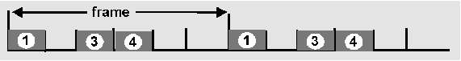

# 資料鏈結層(data link layer)

兩個實際相連的設備間
，如：host-router, router-router, host-host
。以訊框(frame)為資料的單位
。

此層的主要功能為：

* 把上層的datagram加頭加尾封裝成frame
* 定義媒介上的存取方式
* 使用實際位址 (physical addresses)，如網卡的MAC address。
* 實際連接兩點之間的可靠傳輸，如在傳送端和接收端的流量控制。
  * 錯誤偵測 (Error Detection)&#x20;
    ：訊號衰減和雜訊會造成錯誤發生
    。當接收端發現錯誤，會通知傳送端重送或是把訊框給丟掉
    。
  * 錯誤修正&#x20;
    ：由傳送端辨別並修正錯誤的位元，避免重送
    。
  * parity check, checksum

## 多重存取協定 (multiple access protocol)

單一共享頻道上有兩個或以上節點要同時存取資料
，但一次僅能容許一個節點存取&#x20;
。由分散式的協定來決定媒介的存取(決定哪一個節點可以存取)
。

多重存取協定可分為以下幾類：

* 分割頻道 (Channel Partitioning)
  * 把頻道分成許多小塊 (例如.時間槽, 頻率)
  * 分配小塊給節點使用
* 隨機存取 (Random Access)
  * 允許發生碰撞
  * 重點在發生碰撞後的處理動作
*   輪流
    (polling)

    * 嚴格地調節共享媒介的使用，以不發生碰撞為目的

### 頻道分割MAC協定: TDMA (time division multiple access)

* 每一個節點可以得到固定長度的slot(長度 = 封包傳輸時間)
* 沒用到的slot稱為idle&#x20;
* 範例: 6-station LAN, 1,3,4有封包, slots 2,5,6 idle&#x20;
* TDM (Time Division Multiplexing): 頻道分割成 N個時間槽, 每個節點使用一個

### 頻道分割MAC協定: FDMA(frequency division multiple access)

* 頻譜分割成幾個頻帶
  ，每一個節點使用固定的頻帶
  ，頻帶中可能有沒用到的傳輸時間
  。
* 範例: 6-station LAN, 1,3,4有封包, 頻帶2,5,6idle 。

.png>)

### 頻道分割MAC協定：CDMA (code division multiple access)

* 指定唯一的code給每一個使用者，是為分割code set
  ，通常用在無線寬頻頻道 (cellular, satellite)
  。
* 所有的使用者分享一樣的頻率但是使用自己的code去編碼
  。
* encoded signal = (original data) X (chipping sequence)
* decoding: inner-product of encoded signal and chipping sequence
* 允許許多使用者同時傳送資料
  。

### Slotted ALOHA

時間分割成等長的slot
，節點在下一slot的開頭就傳送封包
，如果發生碰撞：以p的機率重送封包直到成功為止
。

假設有N個節點要傳送封包
，每個slot以p的機率傳送封包
，成功傳送的機率S 約為37% (最佳情況)。

### pure (unslotted) ALOHA

設計較簡單，非同步
，封包不會等到在slot的開頭才傳送
，但會增加碰撞的機率
。

假設有N個節點要傳送封包
，每個slot以p的機率傳送封包
，成功傳送的機率S 約為18% (最佳情況)。

### CSMA (Carrier Sense Multiple Access)

CSMA: 傳送之前會先聽
傳送的頻道：

* 如果聽到idle：馬上傳送。
* 如果聽到busy：延遲傳送
  。
  * Persistent CSMA：等到發現媒介idle，以p的機率重送
    。
  * Non-persistent CSMA：亂數延遲一段時間
    。

### CSMA/CD (Collision Detection)

CSMA/CD：載波偵測(carrier sensing)。如CSMA一般會延遲傳送
：

* 會偵測碰撞
  。
* 發生碰撞就取消傳送，發出訊號告知其他節點，可降低頻道的浪費
  。
* 以persistent或是non-persistent的機制重送
  。

Jam Signal：用來保證所有的節點都知道發生碰撞，48 bits
。

Exponential Backoff：&#x20;
用來調節何時重送的機制

* 第一次發生碰撞：從{0,1}中選出K；延遲時間等於 K x 512位元的傳輸時間
  。
* 第二次發生碰撞：從{0,1,2,3}選出K
  。
* 直到第十次以後。固定從{0,1,2,3,4,…,1023}選出K
  。

### 輪流(polling)

主節點邀請其他節點以輪流的方式傳送
，利用RTS/CTS訊息
。

Token passing：節點輪流保管token
，拿到token可以傳送封包
。

## MAC位址 (實際位址)

在同一網路中，實際互連的設備用來通訊的位址
，網路卡的ROM中紀錄著48位元的MAC位址
。每一張網路卡有唯一的MAC位址
。

MAC位址的分配由IEEE管理
，製造商使用部分的MAC位址以保證唯一性
，MAC位址是平面的，所以網路卡可以拿到任意網路下使用。
相反的，IP位址是階層式的，和所連接的網路有關
。

## ARP 協定

ARP協定用於已知設備IP位址, 想推知MAC位址(實際位址)
。

設備A首先會對網路廣播ARP查詢封包, 裡頭包含設備B的IP位址
。在區域網路中的所有節點都會收到此一查詢封包，當B收到此一封包，就回覆自己的MAC位址(實際位址)給A
。

如果B不在區域網路中, 則gateway會回覆自己的MAC位址給A
，A會儲存IP和MAC位址對應的關係
。

### 封包經路由器到另一個區域網路的過程

* A(111.111.111.111)有IP封包要傳送到B(222.222.222.222)
* A利用ARP查詢R(111.111.111.110)的MAC位址
* A以R的MAC位址為目的地端，產生Ethernet訊框
* A的資料傳輸層傳送Ethernet訊框
* R的資傳輸層接收Ethernet訊框
* R發現Ethernet訊框是包含要到B的datagram
* R利用ARP去找到B的MAC位址
* R以B的MAC位址為目的地端, 產生Ethernet訊框

## 乙太網路訊框結構(Ethernet frame)

網路卡會把IP封包封裝成Ethernet訊框
。

Preamble:&#x20;

* 在10101011之後有7個位元組的10101010
* 用來同步傳送端和接收端的clock rate

* (MAC) Addresses: 6個位元組，48-bits
  。
* Type: 表示上一層的協定，通常是IP
  。
* CRC: 接收端會檢查此一欄位，如果錯誤就會丟棄此一訊框
  。

## 乙太網路 (ethernet)

### 10Base2

* 10: 10Mbps
  ，2: 佈線最長可達200公尺
  。
* 線材：同軸線
* 拓撲：匯流排
* Segment之間可用repeater加以連接
  。
* Repeater功用在於加強和修補收到的訊號，再送出去，屬於第一層(實體層)的網路設備
  。

### 10BaseT/100BaseT

10/100 Mbps
，100Mbps又稱為fast Ethernet
，T表示雙絞線(Twisted Pair)
。

使用hub技術
，運用在星型拓撲
，在hub上實作CSMA/CD
，節點到hub的最長佈線長度為100公尺
。

### 1000BaseT

Ethernet標準訊框，允許點對點連線和共享廣播頻道
。在共享模式中， 節點間的距離較短
。使用稱作“Buffered Distributors”的hub
，點對點連線是全雙工的1G bps
。

### Token pass (IEEE 802.5)

速度為4 Mbps ，最長token擁有時間：10 ms，限制訊框的長度
。

* SD/ED：表示封包的開始/結尾
  。
* AC： access control byte。
  * token bit： 0：表示token可以被使用， 1：表示資料是根據FC
    。
  * priority bits：封包的優先權
    。
  * reservation bits：優先權較高的節點可以利用此一位元防止優先權較低的節點拿到token
    。
* FC： frame control
* source, destination address: 48 bit 實際位址
* checksum： CRC&#x20;
*   FS: frame status： 由目的地端設定
    ，告知傳送端已經收到
    ，DLC-level ACKing
    。

## 集線器(hub)

實體層的設備：可視為repeater的變形，重複訊號給所有的介面
。Hub可以架設成階層式，節點都在同一碰撞區域內
。

優點
：

* 簡單、便宜、容易佈置
  。
* 延長佈線的長度限制
  。

限制：

* 訊號碰撞區域的相同，效能並沒有提升
  。
* 相同的碰撞區域一樣會限制住可加入LAN的節點數目
  。
* 無法和其他Ethernet技術相連
  ，如 10BaseT和100 BaseT
  。

## 橋接器(Bridge)

為鏈結層的設備，檢查乙太網路訊框的標頭，決定要送往的目的地
。橋接器的主要功能為可以分割碰撞區域(collision domain)
。

優點
：

* 分割碰撞區域可以增加效能並且沒有節點數目的限制
* 可連接不同Ethernet技術的網路
* 通透性：對網路卡來說，不必知道橋接器的存在
  。
* 同一網段(segment)的封包不會透過橋接器流到外面
  。

### 橋接器和路由器的比較

* 均為store-and-forward設備
  * 路由器是網路層設備 (檢查網路層的標頭)
  * 橋接器是鏈結層的設備
* 路由器會維護路由表，依路由演算法運作
  。
* 橋接器會維護filtering tables, 依照filtering, learning, spanning tree演算法運作。

|    | 橋接器                              | 路由器                                   |
| -- | -------------------------------- | ------------------------------------- |
| 優點 | 簡單，額外需要的頻寬較小&#xD;                | 
支援任意拓撲，路由協定可避免迴圈，和廣播風暴

 |
| 缺點 | 必須用spanning tree演算法, 支援固定拓撲&#xD; | 需要人力設定, 需要額外的頻寬較多                     |
| 大小 | 適用在小網路                           | 適用在大網路&#xD;                           |

## 交換器(Switch)

以第二層MAC位址轉送、過濾封包
，同時傳輸A到B, 和A’到B’ ，而不會發生碰撞
。支援較多的介面，通常以星型拓撲連接
，為沒有碰撞的乙太網路。

cut-through switching： 接收端口不用”等到接收到完整訊框, 再加以轉送到出口端口，可降低轉送的延遲
。且可與shared/dedicated, 10/100/1000 Mbps interfaces合併使用
。

## IEEE802.11 Wireless LAN

IEEE 802.11 標準
，主要定義MAC協定和使用ISM頻帶:900Mhz,  2.4Ghz。

Basic Service Set (BSS)包含：

* wireless hosts
* access point (AP)

許多BSS可組成一distribution system (DS)。

### Ad Hoc網路

Ad hoc network: IEEE 802.11 station 可以動態形成一個沒有AP的網路。

應用：

* 會議廳, 車輛交通
* 個人通訊設備的互連
* 戰場環境

### IEEE 802.11 MAC協定：CSMA/CA

802.11 CSMA 傳送端
：

* 如果持續聽到維持DISF的頻道idle, 就傳送訊框
* 如果聽到頻道是busy, 就開始做binary back-off

802.11 CSMA 接收端
：

* 如果成功接收一訊框, 就等SIFS後回覆ACK

NAV: Network Allocation Vector

* 802.11 訊框包含傳送時間的欄位
* 其他節點聽到此一訊框，就會依照NAV延遲時間傳送

### Hidden terminal

hidden terminal即A和C互相聽不到彼此，如果同時傳送，就會在B 發生碰撞。CSMA/CA可以解決在B發生碰撞的問題。

### RTS/CTS

CSMA/CA：做頻道預留

* 傳送端送RTS ( request to send)
* 接收端回覆CTS (clear to send)
* CTS幫傳送端預留頻道，通知可能原本是隱藏的節點。
* RTS和CTS是小的訊息，較不會發生碰撞。

## Point to Point Data Link Control

一條連線兩端有傳送和接收端

* 沒有Media Access Control
* MAC位址在此沒有必要
* 例如: 撥接網路, ISDN 連線

常見的 point-to-point DLC 協定

* PPP (point-to-point protocol)
* HDLC: High level data link control

PPP DLC協定要求：

* packet framing: 封裝網路層的封包
* bit transparency: 必須可以完整重現上層的資料(bits)
* error detection:不做錯誤修正
* connection livenes: 偵測訊號錯誤通知網路層
* network layer address negotiation: 兩端點可以(互相)學習/設定網路層位址

但不要求：

* 不做錯誤的修正/回復
* 不做流量控制
* 允許不照順序的封包傳送
* 不支援多點的連線，如輪詢系統
* 錯誤修正，流量控制，資料重新排序等工作留給網路的上一層去解決

### PPP 資料訊框 (Data Frame)

* Flag: 分別訊框的符號
* Address:  無意義
* Control: 無意義
* Protocol: 上一層的協定 (如: PPP-LCP, IP, IPCP等等)&#x20;
* info： 資料
* check： CRC

### 位元填塞 (Byte Stuffing)

在資料欄位中可能會包含和flag一樣的pattern  <01111110>，會造成接收端的誤解。

解法是傳送端在< 01111110>之後填塞多餘的< 01111110>位元組，而接收端 連續收到兩個<01111110>， 就丟棄一個，另一個當作是資料。收到單一<01111110>時視為flag byte。

