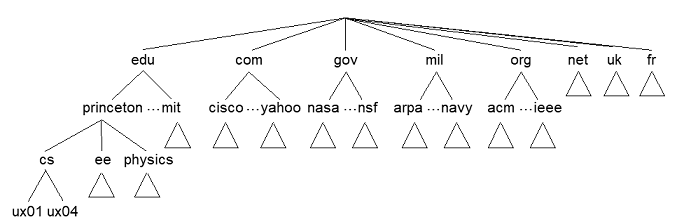
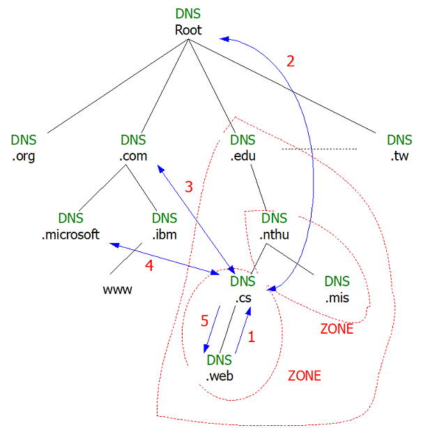
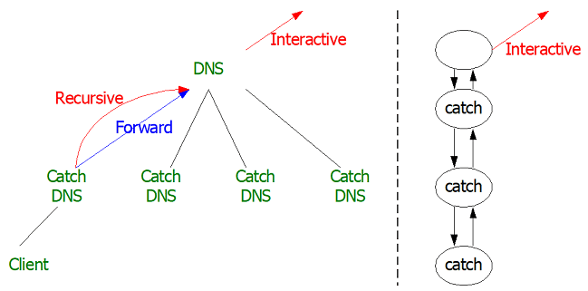
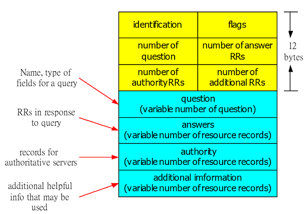

# DNS

## 為什麼我們要使用DNS (domain name system)?

* 可以幫助我們對應IP位址和主機名字(hostname)
  ，無須記憶IP位址，只需記憶名字。
* DNS是一個分散式的資料庫，將許多name servers變成階層式架構。
* DNS是屬於應用層的協定，Host, routers, name server透過溝通來達成解析名稱的目的(address/name translation)。

為什麼我們不採取集中式DNS？

* 如果單一DNS server壞了，會影響很大
* Traffic volume，一台server不可能處理全部的位址解析。
* Server所放置的位置過遠
* 維護不易

DNS server分級

*   當地名稱伺服器(Local name server)：負責當地名稱解析，如解析不成，往上詢問root server。

*   根名稱伺服器(Root name server)：負責解析當地DNS無法解析之name。

* 認證名稱伺服器(Authoritative name server)：Host都會來此主機註冊，當root server亦無法解析名稱時，就會詢問authoritative name server。

## FQDN (Fully Qualify Domain Name)

一個將名稱與位址對應的機制，為的避免名稱重複以及做流量控制。一個DNS name = 一個FQDN，一個FQDN名稱可以對應到多個IP。

名稱解析的流程：Interactive Query

1. web往cs DNS主機查詢，找不到時往root DNS找。
2. cs DNS主機(問: .com主機的IP)往root DNS主機查詢(答: .com DNS主機的IP)。
3. cs DNS主機(問: microsoft.com主機的IP)往com DNS主機查詢(答: microsoft.com DNS主機的IP)。
4. cs DNS主機(問：www.microsoft.com主機的IP)往microsoft.com的DNS主機查詢(問：www.microsoft.com主機的IP)。取得名稱解析後的IP，會放在cs主機的快取中。
5. cs DNS主機回覆給web。

### Recursive Query

為了Load balance還有一種Recursive Query，使用Forward方式進行（以DNS為單位，對象不一定為上游）。執行順序：
Interactive Query, Recursive Query。

## DNS的種類

Interactive Query和Recursive Query的分別：

* Interactive Query：尋找到完整的名稱
* Recursive Query：為了Load balance的目的


DNS的種類區分：

* Primary DNS：有自己的ZONE
* Secondary DNS：有從別人那一邊copy的ZONE（只要有就算）
* Master DNS：自己的ZONE被別人Copy
* Catch DNS：每一台DNS Server都算是&#x20;

## ZONE

ZONE：是一個特殊單位。一個ZONE一定要有一個DNS來管，但是一個DNS可以管理許多的ZONE，而每一個ZONE都有一個ZONE File。

### ZONE File&#xD;

* SOA （Start-of-Authority）
* Version Number（判斷新舊，但clock要相同）
* Refresh timer（一個ZONE有兩個DNS Server, Secondary Server每隔一段時間去跟Master Server複製）
* Entry timer
* Expire time
* TTL（問到機器的IP後可存放在catch中的時間。if TTL=0，多用於Proxy, DHCP）
* NS（Name Server）
* MX（Mail Exchange Server）
* A（Host）：ZONE有多少台機器，需要Dynamic update
* CN（alias）：多IP對應一台主機
* PTR（Pointer）：
  * 有IP查名稱（逆向查詢）
  * 正向查詢：---.ZONE
  * 逆向查詢：97.25.163.in-addr.arpa

## DNS的紀錄檔

DNS: distributed database storing resource records (RR)

RR格式為：(name, value, type, ttl)

* type=A
  * name為主機名稱
  * value為IP位址
* type=NS
  * name為domain(如foo.com)
  * value為此domain的授權名稱伺服器的IP
* type=CNAME
  * name為某些真實名稱的別名
  * value為真實的名稱
* tpye=MX
  * value為郵件主機名稱的hostname

## DNS協定的訊息格式

DNS的query和reply訊息格式是一樣的。

* Identification：一個16 bit的代號，query和reply都使用同一個代號。
*

    Flags：

    * query或reply
    * Recursion desired
    * Recursion available
    *   Reply is authoritative

