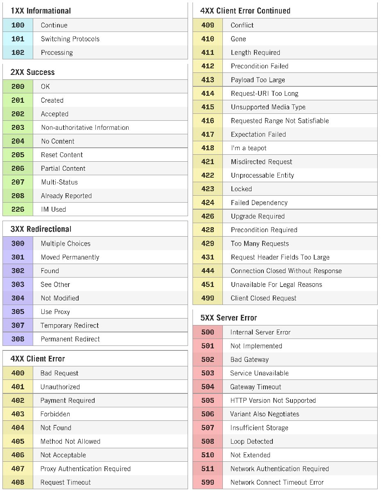
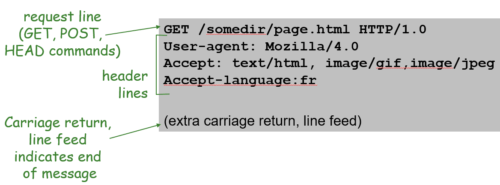
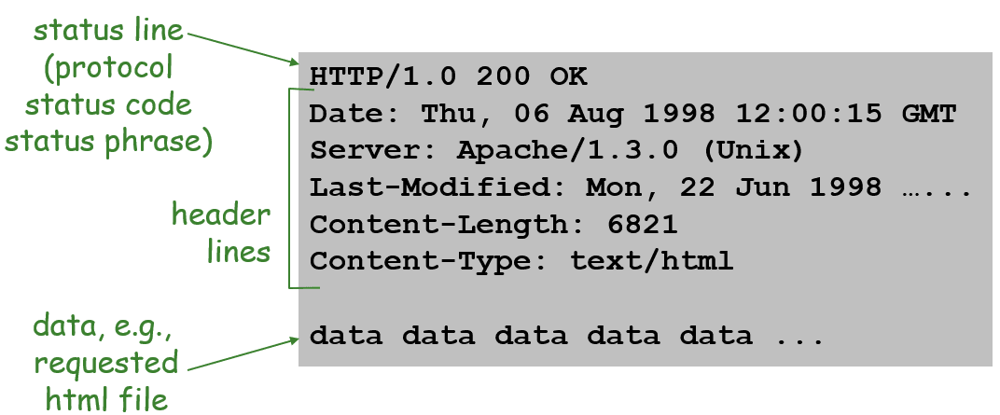
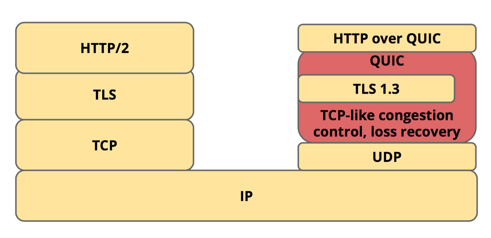
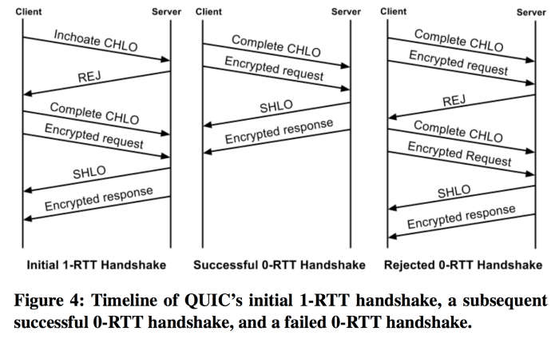

# HTTP

簡介

* 支援客戶/伺服器模式。
* 簡單快速：客戶向伺服器請求服務時，只需傳送請求方法和路徑。請求方法常用的有GET、HEAD、POST。每種方法規定了客戶與伺服器聯繫的型別不同。由於HTTP協議簡單，使得HTTP伺服器的程式規模小，因而通訊速度很快。
* 靈活：HTTP允許傳輸任意型別的資料對象。正在傳輸的型別由Content-Type加以標記。
* 無連線：無連線的含義是限制每次連線只處理一個請求。伺服器處理完客戶的請求，並收到客戶的應答後，即斷開連線。採用這種方式可以節省傳輸時間。
* 無狀態：HTTP協議是無狀態協議。無狀態是指協議對於事務處理沒有記憶能力。缺少狀態意味著如果後續處理需要前面的資訊，則它必須重傳，這樣可能導致每次連線傳送的資料量增大。另一方面，在伺服器不需要先前資訊時它的應答就較快。

<figure>
<figcaption>http狀態碼</figcaption>
</figure>

<figure>
<figcaption>http與http2多工比較</figcaption>
</figure>

## HTTP Request and Response

訊息是使用ASCII text所寫，易於閱讀。

<figure>
<figcaption>HTTP　Request</figcaption>
</figure>

<figure>
<figcaption>HTTP Response</figcaption>
</figure>

## HTTP/3：QUIC傳輸協議

<figure>
<figcaption>HTTP2與HTTP3傳輸協議</figcaption>
</figure>

HTTP/2傳輸協議(要由 TCP + TLS 1.2 + HTTP 所組成。隨著時間的演進，越來越多的網路流量都往手機端移動，手機的無線網路環境會遇到的問題像是(1)封包丟失機率較高、(2)較長 Round Trip Time (RTT) 和 (3) Connection Migration 問題等等，都讓主要是為了有線網路設計的 HTTP/TCP 協議遇到貧頸。

Google 在 2013 年發表了一個新的傳輸協議 QUIC (Quick UDP Internet Connection)。不同於 HTTP/2，QUIC 採用的是較不可靠的 UDP 當做傳輸層，再另外在 QUIC 層上實作 Loss Recovery 和 Congestion Control，並且引入新的設計以支持多路複用、降低連線交握的延遲、解決重傳歧異和支持 Connection Migration 等等。之所以不直接修改TCP協議的原因，主要是因為 TCP 和 UDP 大部分都是在作業系統的核心實作，無法快速的升版並廣泛地被採用，所以才直接在目前系統都已經支援的 UDP 的上層動手腳。

IETF 的 QUIC Work Group 在2018年把 QUIC 重新命名為 HTTP/3，把 QUIC 確立為下一代傳輸協議的標準。其中 IETF 對 QUIC 做了一些更動，像是將 QUIC 改成較通用的傳輸協議，除了支援 HTTP，也支援 SMTP、DNS 和 SSH 等等。也將原本 QUIC 裡面的 QUIC Crypto 加密機制改用 TLS 1.3 取代。

與HTTP/2相比，QUIC 主要具有下列優勢：

* 減少建立連線所需的時間
* 增進網路壅塞控管
* 多路復用避免HOL (head of line) blocking
* 前向錯誤更正
* 移動中WIFI與4G網路切換時不需要重新建立連線

### 連線建立 (Connection Establishment)

原本的TCP/IP協議在每次連線時都會進行的三向交握(Three-Way Handshake)，總共會耗時 1.5 個 RTT (round trip time)。如果再加上 TLS 的傳輸時間，整個連線的建立每次都需要花上 3 個 RTT 的時間。在傳輸速度越來越快的現在，每次連線中，傳輸資料所花的時間也變得越來越短，使得連線時交握所花的時間，對傳輸效能的影響佔比也就越來越大。

QUIC因此提出一個新的連線建立機制，初始的連線交握和金鑰的交換，只需要花1個RTT的時間。藉由將初始連線交握的金鑰快取在客戶端，從第二次連線開始，之後的每一次連線都可以直接開始傳輸數據，如下圖中，達到零交握延遲 (0-RTT Handshake Latency) 的優勢，直接在一個經過認證且加密的通道內傳輸數據。

<figure>
<figcaption>QUIC連線握手</figcaption>
</figure>

QUIC 連線的建立主要分為兩個步驟：(1)初始交握和(2)最終與重複交握，下面分別對這兩個步驟做詳細的介紹。

### 初始交握 (Initial Handshake)

在連線的一開始，客戶端會傳送一個哈囉訊息 (CHLO, Client Hello) 到服務端，觸發服務端回傳一個代表交握未建立或是公鑰已經過期的拒絕訊息：REJ 封包，REJ 中包含四筆資料：

* Server Config：包含服務端的長期DH公鑰 (Diffie-Hellman Public Key)
* Certificate Chain：用來對服務端進行認證的憑證串鏈
* Signature of the Server Config：經過數位簽章過的 Server Config，讓客戶端可以驗證這些資訊確實是由服務端發出。
* Source-Address Token：經過認證加密過後的客戶端IP資訊

在客戶端收到 REJ 後，依照 QUIC的 定義，雙方就已經完成了交握，可以開始安全的傳輸資料。這是為什麼呢？讓我們看看從 REJ 中客戶端得到了哪些資訊：

* 服務端的驗證：透過憑證串鏈和數位簽章，客戶端可以驗證服務端的真實性和資料的可靠性。
* 初始密鑰 (Initial Key)：客戶端在收到 REJ 後，首先要為這次連線隨機產生一個自己的短期DH密鑰，將自己的短期密鑰和服務端的長期公鑰進行運算後，就可以得到一個初始密鑰。(這邊密鑰的交換使用的是 Diffie–Hellman key exchange)

有了初始密鑰後 (暫時性的密鑰)，客戶端就可以用這把密鑰對想要傳輸的資料 (request) 進行加密，安全的傳送給服務端。除了對資料進行加密外，客戶端也必須將自己剛剛產生的短期DH密鑰所對應的『公鑰』，放入一個叫做 Complete CHLO 的封包中，和 request 資料一并用初始密鑰加密後回傳給服務端，如上圖左。因此，拿到 Complete CHLO 封包的服務端，就同時擁有了客戶端的短期DH公鑰和自己保存的長期DH密鑰，服務端便可以同樣透過運算，拿到與客戶端一模一樣的那一把初始密鑰，用來對資料進行加密與解密。

### 最終與重複交握 (Final and Repeat Handshake)

如果一切都順利，服務端便會產生一個叫做 SHLO (Server Hello) 的封包，封包中包含了服務端新產生的短期DH公鑰 。之後，服務端便會將要回傳的 response 資料和產生的 SHLO 封包，都用初始密鑰進行加密，再一并回傳給客戶端，如上圖左。此時，客戶端與服務端已經使用初始密鑰進行了一次資料交換，並且在初始密鑰的加密保護下，交換了彼此的短期DH公鑰。這邊要特別提到兩邊的短期DH公鑰和密鑰都是專門為這次的連線新產生的，每一次建立連線都會產生新的短期DH公鑰和密鑰。接下來要進行的，就是更換初始密鑰。

初始密鑰畢竟是基於服務端的長期DH公鑰所產生的，在公鑰失效前，幾乎所有的連線使用的都是同一把公鑰，具有一定程度被 compromise 的可能。為了達到前向保密 (Forward Secrecy) 的安全性，客戶端與服務端便會再用彼此交換而來的短期DH公鑰，與自己保存的短期DH密鑰做運算，產生一個僅限於這次連線使用的前向保密密鑰 (Forward-Secure Key)，後續資料的加密和解密，就都會改用這把新的密鑰，達到前向保密安全性。這樣就完成了最終密鑰的交換、連線的交握和 QUIC 連線的建立。

當下一次要重複建立連線時，客戶端會使用自己之前 cache 的服務端長期公鑰，加上自己新擇定的短期密鑰，重新產生一把與之前不同的初始密鑰，直接在初始密鑰的保護下傳送 request 給服務端，達到零交握延遲連線 (0-RTT Handshake Latency)，如上圖中。當服務端的長期公鑰失效時，服務端會重新回傳一個新的 REJ 封包，重新與客戶端進行交握，總共一樣只會花費 1 個 RTT 的時間，如上圖右。

### 多路複用 (Stream Multiplexing)&#xD;

當 TCP 連線傳輸的一個封包遺失時，在發送端主動發現並且重新傳送前，整個連線的傳輸都會被卡住，這就是TCP 的 Head of Line Blocking (HOL Blocking) 問題。

因為 QUIC 支持在同一個連線中進行多個 Stream 的資料傳輸，所以當某一個 Stream 中的封包遺失時，只有這一個 Stream 的傳輸會受到影響，其他 Stream 可以完全不受影響的繼續進行資料傳輸，避免 HOL Blocking。

QUIC 的 Stream Multiplexing 具有以下幾點特性：

* 每個 Stream 可以用來傳輸少量的數據，或是最多 2^64 bytes 的數據
* 每個 Stream 有一個自己的 Stream ID，為了避免衝突，由客戶端發起的 Stream，ID 為奇數，由服務端發起的 Stream，ID 則為偶數。
* 直接用一個新的 Stream ID 傳送數據就會開啟一個新的 Stream，關閉一個 Stream 時則需要將 Stream Frame 裡面的 FIN bit 設定為 true。 Stream 如果被關閉後，遺失的封包將不會被重傳。
* 每一個 Stream 要傳輸的資料都是封裝在一個或者是多個 Stream Frame 中傳輸。
* QUIC 連線中傳輸的 QUIC 封包，可以同時攜帶多個 Stream Frames。每一個 Stream Frame 可能都分別來自不同 Stream。

### 封包遺失恢復 (Loss Recovery)&#xD;

過去TCP在封包遺失恢復策略所用的做法，是在發送端為每一個封包標記一個編號 (sequence number)，接收端在收到封包時，就會回傳一個帶有對應編號的 ACK 封包給發送端，告知發送端封包已經確實收到。當發送端在超過一定時間 (Retransmiting Timeout, RTO) 之後還沒有收到回傳的 ACK，就會認為封包已經丟失，啟動重新傳送的機制，複用與原來相同的編號重新發送一次封包，確保在接收端這邊沒有任何封包漏接。

這樣的機制會有什麼問題呢？假設發送端總共對同一個封包發送了兩次 (初始 + 重傳)，使用的都是同一個 sequence number：編號N。之後發送端在拿到編號N封包的回傳 ACK 時，將無法判斷這個帶有編號N的ACK，是接收端在收到初始封包後回傳的ACK (較長RTT)，還是接收端在收到重傳封包後回傳的ACK (較短RTT)，這就是TCP重傳歧異問題 (TCP retransmission ambiguity problem)。

ACK 是屬於初始封包還是重傳封包如果判斷錯誤，會造成 TCP 演算法對連線通道內實際 RTT (Round Trip Time) 取樣和預測的誤差，影響後續壅塞控制 (congestion controll) 演算法的判斷。RTT 如果被不真實的放大， RTO 就會隨著 RTT 的增加呈現指數型成長，嚴重拉長封包重傳的反應時間。

QUIC為了避免重傳歧異問題，發送端在傳送封包時，初始與重傳的每一個封包都改用一個新的編號，unique packet number，每一個編號都唯一而且嚴格遞增，這樣每次在收到ACK時，就可以依據編號明確的判斷這個 ACK 是來自初始封包或者是重傳封包。接收端則是藉由封包內的 Stream ID 和 Stream Offset 的值，辨認封包是屬於哪一個 Stream，再依照每個封包的 Offset 將資料照順序重組。簡單來說就是將原本由 sequence number 一手包辦的封包傳輸順序和封包資料位置(offset)的資訊，拆分成由 unique packet number 和 Stream Offset 兩個數字分別記錄，如此就同時解決了重傳歧異和封包重組的問題，大大提昇 RTT 的取樣與預測的準確度，盡可能的降低封包重傳的反應時間。

### 流量控制 (Flow Control)

透過流量控制可以限制客戶端傳輸資料量的大小，有了流量控制後，接收端就可以只保留相對應大小的接收 buffer，優化記憶體被佔用的空間。但是如果存在一個流量極慢的 Stream ，光一個 Stream 就有可能佔用掉接收端所有的 buffer。QUIC 為了避免這個潛在的 HOL Blocking，採用了連線層 (connection flow control) 和 Stream 層的 (stream flow control) 流量控制，限制單一 Stream 可以佔用的最大 buffer size。

### 連線遷移 (Connection Migration)

目前要識別 TCP 的連線，需要用(1)來源IP、(2)來源port、(3)目標IP和(4)目標port總共四個參數來區分收到的封包是屬於哪一個 TCP 連線。這個機制的缺點就是當客戶端的IP變動時，例如手機從WIFI連線轉移到4G網路連線，原本的連線就全部失效了。這在頻繁於 WIFI 網路與不同的 3G 和 4G 網路中做切換的手機使用情境上，TCP 協議就顯得非常的不友善。

因此 QUIC 為了可以很平順的處理傳輸過程中的 Connection Migration 問題，它連線的識別採用的是一個 64 bits 的獨立 Connection ID，ID 由客戶端在建立連線時隨機產生。當客戶端的 IP 改變時，只要客戶端繼續使用舊的 Connection ID 傳送封包，即使新發送封包的來源 IP 位址不同，接收端也可以透過 Connection ID 順利的識別新封包所歸屬的連線。而原本正在傳遞中，存有舊 IP 的封包，也一樣也可以透過 Connection ID 來識別，正確的被接收端接收。

