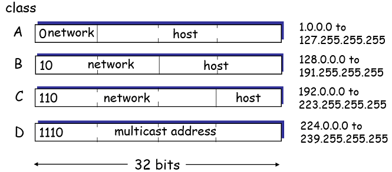
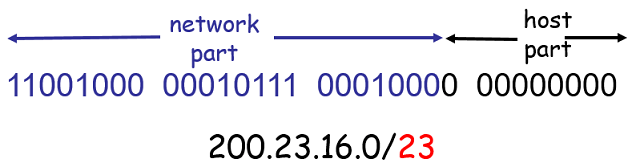
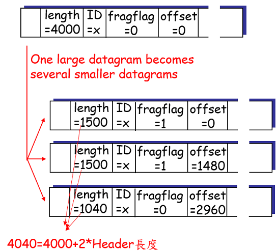
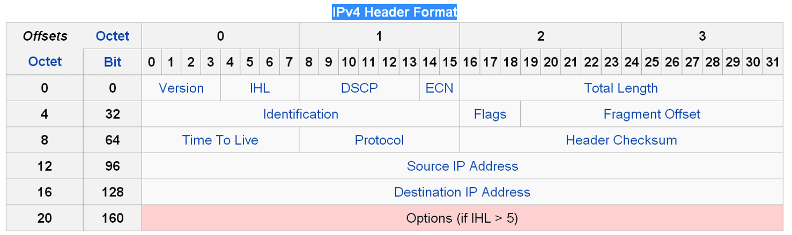

# Internet protocol

## 網路層的主要功能

* Routing:決定封包\(packet\)適當的傳輸路徑。
  * Routing Algorithms:計算傳輸路徑的演算法。
* Switching:將封包轉送至適當的出口埠。
* Call Setup:在傳送資料前建立整條傳輸路徑。

協助通訊的兩端在資料\(Data Flow\)真正開始傳送之前建立連線\(example: TCP 3-way handshaking, ATM\)。


## IP address

IP address由兩個部分組成：

* Network part:較高位\(High order part\)的位元用來辨識網域。
* Host Part \(Interface part\):較低位\(Low order part\)的位元用來辨識主機。

要申請IP位址網段必須要向ICANN \(Internet Corporation for Assigned Names and Numbers\)申請。

### 何謂一個網域\(Network\)?

IP address具有相同高位位元\(Network Part\)的介面所成的統稱。
這些介面彼此互相連接而不透過router \(Layer-3 Device\)。

### 網路遮罩\(Network Mask\)

用來判斷IP位址中的Network Part以及Host Part。
例： 223.1.1.4/24，代表左邊24個位元是Network part，剩下的8位元是host part。

IP網路位址可以依照前面若干個位元來區分是屬於哪個class \(A, B, C, D\)。

利用網路遮罩\(Network Mask\)可以將取得的一段IP再度分割成更小段的子網路\(sub-network\)。



### CIDR: \(Classless Inter Domain Routing\)

如果完全依照class來分配IP位址，可能無法有效的利用IP位址\(空著很多IP並未使用\)。IP位址的Network part長度並未固定，可以依照Network Mask來決定Network part的長度。



## IP封包切割與重組

MTU \(Maximum Transfer Unit\)： 表示Link-Layer所能夠傳送封包的最大長度\(會因不同的Link-Layer而有不同的MTU\)。

IP封包的切割：

* 在傳送過程中將一個封包切割\(fragmentation\)為若干個小封包。
* 在接收端接收到以後利用Header中的identifier重新組合\(reassembly\)。





## IPv4

IPv4是一種無連接的協定，操作在使用封包交換的連結層（如乙太網路）上。此協定會盡最大努力交付封包，意即它不保證任何封包均能送達目的地，也不保證所有封包均按照正確的順序無重複地到達。這些方面是由上層的傳輸協定（如傳輸控制協定）處理的。

IPv4使用32位元（4位元組）位址，因此位址空間中只有2^32個位址。不過，一些位址是為特殊用途所保留的，如專用網路（約1800萬個位址）和多播位址（約2.7億個位址），這減少了可在網際網路上路由的位址數量。這些限制刺激了仍在開發早期的作為目前唯一的長期解決方案的IPv6的部署。

IPv4位址可被寫作任何表示一個32位元整數值的形式，但為了方便人類閱讀和分析，它通常被寫作點分十進位的形式，即四個位元組被分開用十進位寫出如127.0.0.1，中間用點分隔。

[Linux kernel 表頭檔](https://github.com/torvalds/linux/blob/master/include/uapi/linux/ip.h)：



```c
struct iphdr {
  #if defined(__LITTLE_ENDIAN_BITFIELD)
  __u8 ihl: 4,    // 4-bit for version
    version: 4;   // 4-bit for IHL
  #elif defined(__BIG_ENDIAN_BITFIELD)
  __u8 version: 4,
    ihl: 4;
  #else
  #error "Please fix <asm/byteorder.h>"
  #endif
  __u8 tos;       // 8-bit for DSCP+EPN
  __be16 tot_len; // 16-bit for total length
  __be16 id;      // 16-bit for ID
  __be16 frag_off;// 16-bit for flag and offset
  __u8 ttl;       // 8-bit for TTL
  __u8 protocol;  // 8-bit for protocol
  __sum16 check;  // 16-bit for checksum
  __be32 saddr;   // 32-bit for source addr
  __be32 daddr;   // 32-bit for dest addr
  /*The options start here. */
};
```

* IHL \(internet header length\) 4-bit, 此值為表示是由多少個32-bit word所組成，IHL &gt;=5 \(即至少5\*32 = 160 bits = 20 bytes\)，IHL &lt;=15\(最大15\*32 = 480 bits = 60 bytes\)
* version, 4-bit, value=4表示IPv4
* DSCP \( Differentiated Services Code Point\) 6-bit, 可讓您為網路傳輸指派不同的服務等級。
* ECN \(Explicit Congestion Notification, 2-bit\) 只在兩端點均支援此功能時才會使用。
  * 00 傳送主機不支援 ECN。
  * 01 或 10 傳送主機支援 ECN。
  * 11 路由器已遇到擁塞狀況。
  * 當路由器擁塞的程度已經達到填滿傳入封包緩衝區而開始捨棄封包時，會影響網路而縮減頻寬，對資料損失敏感或具時效性的傳輸量流動會進而受到衝擊，而且可能在擁塞之後產生連結閒置時間。TCP/IP 明確擁塞通知 \(ECN\) 讓路由器能夠通知「傳輸控制通訊協定」\(TCP\) 對等體，由於網路擁塞，緩衝區已滿。TCP 對等體會以減緩資料傳輸來回應，協助防止封包損失。
  * IP 表頭中的 8 位元 \[Type of Service \(TOS\)\] 欄位最先定義於 RFC 791 中，指出封包由路由器進行非預設傳送的傳送優先順序、延遲、輸送量、可靠性，以及成本等特性。
* Total length, 16-bit, 整個封包的大小 \(in bytes\), 包含表頭與資料, 20 bytes \(only header\)&lt;=total length &lt;=65535 bytes \(2\*\*16\)
  * packet size太大時，在底層會被切成較小的frame。
    MTU 最大不會超過 65535 bytes。
  * 但是一般說來，過大的 IP datagram 由於傳送上的困難或是其他協定的限制，會被切割為好幾個小部分。
    透過 total length 與 length 欄位的搭配，就可以計算出在 IP datagram 中資料的實際大小
    。
* Identification, 16-bits:
  此欄位是用來識別傳送端所發出的 IP datagram 之用，每個 IP datagram 都會有一個 unique 的 identification 值，一般來講就是以遞增值的方式來作為識別之用
  。
* Flags: 3-bits & fragment offset: 13-bits
  ，此兩欄位是作為進行 fragmentation 時之用
  。
* time to live, TTL: 8-bits
  ，這個欄位中所儲存的值，代表送出的 IP datagram 可以通過 router 數量的上限，此值由傳送端設定，每經過一個 router 會減少 1，當值減為 0 後，則會被丟棄不再繼續傳送，然後傳送端會收到 ICMP 訊息作為通知，避免傳送端一直送出無法達到目的地的封包。
* Protocol, 8-bits, 
   目的是在記錄使用 IP 傳送資料的是上層的哪一個協定
  。
* header checksum, 16-bits
  ，作為檢查 IP header 之用，跟其他協定\(例如：TCP、UDP、ICMP....etc\)的 header 無關，因為其他協定的 header 有自己的 checksum 欄位。
  * 另外，由於 checksum 是依據 IP header 中各欄位所計算出來的，因此在 IP datagram 經過 router 而 TTL 減 1 後，router 會重新計算 checksum 的值並繼續傳遞 IP datagram
    。
* source IP address \(32 bits\)
* destination IP address \(32 bits\)
* options \(不定長度\)
  ：最後這個欄位就比較少用到了，長度不固定，但以 4 bytes\(32 bits\) 為單位，而有可能被用在以下幾個地方：
  * 加強安全性
  * 記錄 route 資訊的
  * 記錄時間戳記
  * 指定 routing 的路徑

## IPv6

雖然 32 位元 IPv4 位址有超過 42.9 億個，但網際網路號碼分配局（IANA）所能派發的全球 IPv4 位址，早在 2011 年 1 月就消耗殆盡。

|  | IPv4 | IPv6 |
| :--- | :--- | :--- |
| 位址數量 | 2\*\*32 | 2\*\*128 |
| 位址表示 | 192.168.1.1 | 2001 : 0DB8 : 02de : 0000 : 0000 : 0000 : 0000 : 0e13 |
| IPSec | 預設不開啟 | 預設開啟 |
| QoS機制 | 表頭欄位不支援 | 表頭欄位支援 |

不過IPv6的位址表示法太長，所以位址有所謂的省略規則，以下為2個位址省略規則：

* 為每組數字的第一個0可以省略，若整組皆為0，則以0表示。譬如，「0DB8」可以省略為「DB8」，「0000」則為「0」。
* 連續出現的0000可以省略成「::」。譬如：「:0000:0000:0000:0000:」可以省略成「:0000:0000:0000::」、「:0:0:0:0:」、「:0::0:」或「::」。

範例：

* 3ffe:0102:0000:0000:0000:0000:0000:0000/32
* 消去每四個位數集合前面的零
   3ffe:102:0:0:0:0:0:0/32
* R用雙冒號取代連續的零集合
   3ffe:102::/32

### 如何在IPv4與IPv6共存下連線

目前較主要的IPv6移轉技術有三個，雙協定堆疊（Dual Stack，以下簡稱雙協定）、穿隧（Tunneling）、轉換（Translation）。

* 以雙協定技術而言，它是讓網路設備同時具備IPv4與IPv6的網路位址，如果要連線至純IPv4網站，就能用本身的IPv4位址去連接，而IPv6亦然。
* 穿隧技術則是在IPv4網路上建立一個隧道，讓個別獨立的IPv6端點能互通。
* 轉換技術則是三個技術中，唯一能讓純IPv4與純IPv6互連的一個方法，它能夠將IPv4位址轉換成IPv6位址，且IPv6亦然。

而目前最建議使用的IPv6轉移技術為雙協定技術，由於它能夠同時擁有IPv4與IPv6的IP位址，使用者不論要連線到哪個網站都可行。雖然這技術的缺點，是雙協定設備的普及度要夠高。使用者才能隨意連線到IPv4與IPv6的網站。

