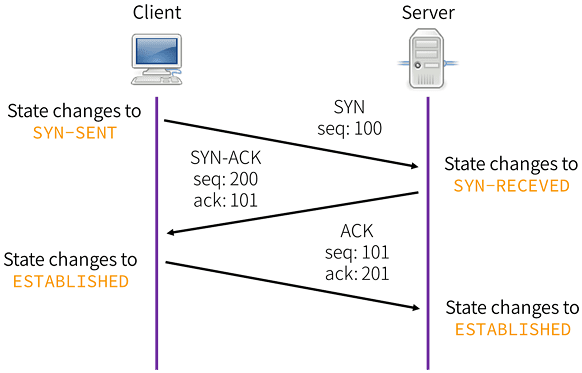

# OSI與TCP分層

分層的理由

* 切割複雜系統成許多小塊
* 容易維護與發展每一分層
* 更動某一分層不會牽動整個系統
* 分層使得每一層的行為容易理解

乙太網路設計初衷是，多個不同的系統，如何讓他們之間流暢的進行資訊交換？這是一種典型的網路，它的設計中優先考慮的是相容性與分佈式。我們可以把乙太網想像成一個快遞包裹分發網絡；

乙太網類似一個快遞包裹分發網絡，這個網絡中所有的快遞中轉站（交換機/路由器）都是獨立運作，根據一套公認的規則（網路協議）進行分揀並投遞對。每個中轉站（網路設備）設備來說，第一，它可能看到發送到任何位址的包裹（分佈式，異構的），所以它收到每個包都要算算該怎麼發（這就要花時間，引入延遲），如果業務太繁忙，收不下來了，就間斷粗暴的把包裹丟棄（丟包）。

當前的主流的資料中心網路都是要解決多個異構系統的互聯問題，即使是單一的大規模應用場景，包括雲計算、大數據等，主流也都是以高吞吐量場景，也就是多個節點做多個事情，對節點之間的通訊延遲沒有很高的要求，更看重的是靈活的接入與擴容。所以這些場景用乙太網就非常合適。

## OSI與TCP/IP模型

ISO所制定的標準中，牽涉到網路通訊方面的就是開放式系統互連 ( Open Systems Interconnection, OSI ) 分層模型，是在1970 年代後期所提出來的。&#x20;

OSI模型是一個概念模型，它建立了一個框架，說明資訊該如何從應用程式、透過網路連線、經過實體的傳輸線，最後來到目標網站或主機。在 OSI模型當中有七層的架構，每一層都有其相對應的協定，定義了資訊傳出的規範。

相較於 OSI模型的七層架構，TCP/IP模型只有四層。雖然說是簡化，但實際上整體的架構還是不脫 OSI 模型的內容。

## OSI分層

### 應用層（Application Layer）&#xD;

應用層主要功能是處理應用程式，進而提供使用者網路應用服務。

### 展示層（Presentation Layer）&#xD;

應用層收到的資料後，透過展示層可轉換表達方式，例如將ASCII編碼轉成應用層可以使用的資料，或是處理圖片及其他多媒體檔案，如JPGE圖片檔或MIDI音效檔。

除了轉檔，有時候當資料透過網路傳輸時，需要將內容予以加密或解密，而這個工作就是在展示層中處理。

### 會議層（Session Layer）&#xD;

這個層級負責建立網路連線，等到資料傳輸結束時，再將連線中斷，運作過程有點像召集多人開會（建立連線），然後彼此之間意見交換（資料傳輸），完成後，宣佈散會（中斷連線）。

有很多應用服務運作在會議層上，我們常接觸到的是NetBIOS names，這是一種用來識別電腦使用NetBIOS資源的依據。我們使用Windows系統時，開啟網路上的芳鄰，或是用到「檔案及列印分享」時，通常會看到群組及電腦名稱，這些就是NetBIOS names定義的。

### 傳輸層（Transport Layer）&#xD;

傳輸層主要負責整體的資料傳輸及控制，是OSI模型中的關鍵角色，它可以將一個較大的資料切割成多個適合傳輸的資料，替模型頂端的第五、六、七等三個通訊層提供流量管制及錯誤控制。

傳輸控制協定（Transmission Control Protocol，TCP）是我們常接觸具有傳輸層功能的協定，它在傳輸資料內加入驗證碼，當對方收到後，就會依這個驗證碼，回傳對應的確認訊息（ACK），若對方未及時傳回確認訊息，資料就會重新傳遞一次，以確保資料傳輸的完整性。

### 網路層（Network Layer）&#xD;

網路層定義網路路由及定址功能，讓資料能夠在網路間傳遞。這一層中最主要的通訊協定是網際網路協定（Internet Protocol，IP），資料在傳輸時，該協定將IP位址加入傳輸資料內，並把資料組成封包（Packet）。在網路上傳輸時，封包裡面的IP位址會告訴網路裝置這筆資料的來源及目的地。由於網路層主要以IP運作為主，故又稱為「IP層」。除了IP，在網路層上運作的協定還包含IPX及X.25。

路由器及Layer 3交換器即屬於第三層的網路裝置，主要以IP作為資料傳輸依據。

### 資料連結層（Data Link Layer）&#xD;

資料連結層介於實體層與網路層之間，主要是在網路之間建立邏輯連結，並且在傳輸過程中處理流量控制及錯誤偵測，讓資料傳送與接收更穩定。資料連結層將實體層的數位訊號封裝成一組符合邏輯傳輸資料，這組訊號稱為資料訊框（Data Frame）。訊框內包含媒體存取控制（Media Access Control，MAC）位址。而資料在傳輸時，這項位址資訊可讓對方主機辨識資料來源。

MAC位址是一組序號，每個網路裝置的MAC位址都是獨一無二的，可以讓網路裝置在區域網路溝通時彼此識別，例如網路卡就是明顯的例子。

不少網路協定是在資料連結層上運作，我們較常聽到的是非同步傳輸模式（Asynchronous Transfer Mode，ATM），以及點對點協定（Point-to-Point Protocol，PPP）。前者是早期網路發展的通訊協定，由於單次傳輸量很小，適合用作語音傳輸；後者則是在我們使用ADSL時，會透過這項協定連線 ISP，從而連上網際網路。

網路交換器（Switch）是這個層級常見的裝置，主要在區域網路上運作，能依據MAC位址，將網路資料傳送到目的主機上。交換器一般分為可設定式與免設定兩種，前者可以設定流量控制或設定子網路分割，後者僅傳輸網路資料，不具其他進階功能。

### 實體層（Physical Layer）&#xD;

實體層是OSI模型的最底層，它用來定義網路裝置之間的位元資料傳輸，也就是在電線或其他物理線材上，傳遞0與1電子訊號，形成網路。實體層規範的內容包含了纜線的規格、傳輸速度，以及資料傳輸的電壓值，用來確保訊號可以在多種物理媒介上傳輸。

網路線、網路卡與集線器（Hub），都是平常容易接觸到的實體層裝置。網路線包括辦公室及機房內常見的RJ-45 UTP雙絞線、有線電視使用的同軸電纜，以及應用在骨幹網路的光纖纜線等。不過，對無線網路而言，只要可以傳輸電波的介質，都屬於它的傳輸媒介。

## TCP分層

### 應用層 (Application Layer )

在應用層當中的協定，定義了應用程式透過網路交換資訊的格式，常見的有 HTTP、HTTPS、FTP (檔案傳輸)、POP3 (接受電子郵件)、SMTP (發電子郵件)、TELNET、SSH 等。

### 傳輸層 (Transportation layer)

在傳輸層當中的協定，定義了傳輸資料的品質（可靠性與順序性），譬如常見的 TCP 與 UDP 協議。

### 網路層 (Internet layer)

網路層當中的協定則定義了資料如何在一個單一網路上傳輸並可以抵達目的地。這裡其實就是靠著先前提到的 IP地址來找到目標位置。

### 實體層 (physical layer)&#xD;

最後的實體層則定義資訊如何透過韌體與硬體間傳遞與接收。

在開發網路應用程式的過程當中，設計師大部分關注多在應用層，因為傳輸層與網路層實作，多半已由作業系統完成(Windows socket, BSD socket等)，而實體層則靠電腦與網路設備完成。

## URL (Uniform Resource Locator)

RFC編號：1738, 1808。URL是通過網路提供的資源的位置和訪問方法的緊湊表示。一個資源是一個可以透過網路存取的任何物件，包括檔案目錄、檔案、文件聲音和影像…等。

一般表示法：`<scheme>:<scheme-specific-part>`。

## URI (Universal Resource Identifier)

RFC編號1630。是一種將用在網際網路中的物件的名稱和位址的表示一致的語法。URL是URI的一種特化。&#x20;

## 傳輸層：TCP vs UDP

TCP 和 UDP 都是透過同樣的方式傳輸資料，並透過 IP 找到目標。不過兩者因為性質上的差異，所以應用場景也有很大的不同。

### TCP

* 連結導向(connection-oriented)
* 要透過TCP溝通需要先建立連線(three way handshake)
* 提供可靠的傳輸(reliable transport)
* 提供流量控制(flow control)
* 提供壅塞控制(congestion control)


TCP 用於需要「可靠通訊」的場景，即資料在傳輸的過程中不會遺漏，而且有正確的順序性。大部分情況下我們都需要 TCP 來保證通訊的可靠性。

### UDP

* 非連結導向(connectionless)
* 要透過UDP溝通不需要先建立連線
* 提供盡力的傳送(best effort transport)

相對於 TCP，UDP 有時也被稱作「不可靠的通訊」。因為 TCP 為了保證「可靠」，必須依賴相對應的機制，而這些機制會使用較多的資源，並降低傳輸效率。而在某些使用場景，像是網路電話、視訊會議、遊戲等，更看重傳輸速度與即時性，品質方面可以稍微犧牲，因此就可以採用 UDP 的傳輸方式。

另一方面，UDP 可以做到一對多的廣播功能，而 TCP 就只能夠一對一通訊。

## TCP狀態轉移圖

TCP 實現可靠的傳輸協議，是靠 SEQ 確認完成的。因此建立一個可靠的單向通道需要至少一次 SYN 和 ACK 完成 SEQ 的確定，並且在今後的通訊中依靠 ACK SEQ(+1) 來確保發送成功。

起初，服務器和客戶端都為CLOSED狀態。在通信開始前，雙方都得創建各自的傳輸控制塊（TCB）。
服務器創建完TCB後遍進入LISTEN狀態，此時准備接收客戶端發來的連接請求。

## TCP建立連線的三次握手( 3-Way handshake)&#x20;

TCP 為了在通訊連線前，確認對方可以準備接收訊號，以及在斷線前，確認對方準備好離線，因此發展出了連線前的 3-way handshake 與離線前的 4-way handshake 機制。

### 連線前的 3-way handshake&#xD;

* CLIENT: 傳送通訊連線請求
  ，發送了 SEQ 100，標志位是 SYN；
* SERVER: 確認允許連線，且發回了 ACK 101 與 SEQ 200，標志位是 SYN 與 ACK（兩個過程合並了）。注意，ACK 是101意味著，伺服端希望接收到 101序列號開始的數據段。
* CLIENT: 確認連線，返回了空的數據，SEQ 101， ACK 201，標志位為 ACK。至此，雙方的開始 SEQ （也就是 ISN）號100與200都被確認接收到了。
* 開始正式發送資料包，注意的是 ACK 依舊是第四行的201，因為沒有需要 ACK 的 SYN 了。

三次握手的原則設計是防止舊復用連接的初始化導致問題，為瞭解決此問題，我們設計了reset這個特別的控制信號來處理。

* 如果接收中的 TCP 在一個未同步狀態如 SYN-SENT, SYN-RECEIVED，它會返回 reset 給對方。
* 如果 TCP 是同步狀態中如(ESTABLISHED, FIN-WAIT-1, FIN-WAIT-2, CLOSE-WAIT, CLOSING, LAST-ACK, TIME-WAIT)，他會終止此連接並通知用戶。

### [TCP 為什麼是三次握手，而不是兩次或四次](https://www.zhihu.com/question/24853633/answer/573627478)？

RFC793講到了為什麼三次握手是必須的，TCP 需要 seq 序列號來做可靠重傳或接收，而避免連接復用時無法分辨出 seq 是延遲或者是舊鏈接的 seq，因此需要三次握手來約定確定雙方的 ISN（初始 seq 序列號）。

若建立連接只需兩次握手，客戶端並沒有太大的變化，仍然需要獲得服務端的應答後才進入ESTABLISHED狀態，而服務端在收到連接請求後就進入ESTABLISHED狀態。此時如果網絡擁塞，客戶端發送的連接請求遲遲到不了服務端，客戶端便超時重發請求，如果服務端正確接收並確認應答，雙方便開始通信，通信結束後釋放連接。此時，如果那個失效的連接請求抵達了服務端，由於只有兩次握手，服務端收到請求就會進入ESTABLISHED狀態，等待發送數據或主動發送數據。但此時的客戶端早已進入CLOSED狀態，服務端將會一直等待下去，這樣浪費服務端連接資源。

我們首先要知道到一點就是， TCP 的可靠連接是靠 seq（ sequence numbers 序列號）來達成的。TCP 設計中一個基本設定就是，通過TCP 連接發送的每一個包，都有一個sequence number。而因為每個包都是有序列號的，所以都能被確認收到這些包。確認機制是累計的，所以一個對sequence number X 的確認，意味著 X 序列號之前(不包括 X) 包都是被確認接收到的。

TCP 協議是不限制一個特定的連接（兩端 socket 一樣）被重復使用的。
所以這樣就有一個問題：這條連接突然斷開重連後，TCP 怎麼樣識別之前舊鏈接重發的包？——這就需要獨一無二的 ISN（初始序列號）機制。

當一個新連接建立時，初始序列號（ initial sequence number ISN）生成器會生成一個新的32位的 ISN，且不太可能會碰撞。發送方與接收方都會有自己的 ISN （下面的例子中就是 X 與 Y）來做雙方互發通信，為了確認雙方的ISN，三次握手是必須的。

三次握手（A three way handshake）是必須的， 因為 sequence numbers（序列號）沒有綁定到整個網絡的全局時鐘（全部統一使用一個時鐘，就可以確定這個包是不是延遲到的）以及 TCPs 可能有不同的機制來選擇 ISN（初始序列號）。

接收方接收到第一個 SYN 時，沒有辦法知道這個 SYN 是是否延遲了很久了，除非他有辦法記住在這條連接中，最後接收到的那個sequence numbers（然而這不總是可行的）。這句話的意思是：一個 seq 過來了，跟現在記住的 seq 不一樣，我怎麼知道他是上條延遲的，還是上上條延遲的呢？所以，接收方一定需要跟發送方確認 SYN。

TCP離線前的4次握手( 4-way handshake
)
-

* CLIENT: 傳送通訊斷線請求
* SERVER: 確認收到斷線請求，並繼續傳送最後的資訊
* SERVER: 最後的資訊傳送完畢，確認可以斷線
* CLIENT: 確認斷線

我們知道，TCP連接是雙向的，因此在四次揮手中，前兩次揮手用於斷開一個方向的連接，後兩次揮手用於斷開另一方向的連接。

* 第一次揮手 若A認為數據發送完成，則它需要向B發送連接釋放請求。
  * 該請求只有報文頭，頭中攜帶的主要參數為： FIN=1，seq=u。此時，A將進入FIN-WAIT-1狀態。
  * PS1：FIN=1表示該報文段是一個連接釋放請求。
  * PS2：seq=u，u-1是A向B發送的最後一個字節的序號。
* 第二次揮手 B收到連接釋放請求後，會通知相應的應用程序，告訴它A向B這個方向的連接已經釋放。此時B進入CLOSE-WAIT狀態，並向A發送連接釋放的應答，其報文頭包含： ACK=1，seq=v，ack=u+1。
  * PS1：ACK=1：除TCP連接請求報文段以外，TCP通信過程中所有數據報的ACK都為1，表示應答。
  * PS2：seq=v，v-1是B向A發送的最後一個字節的序號。
  * PS3：ack=u+1表示希望收到從第u+1個字節開始的報文段，並且已經成功接收了前u個字節。
  * A收到該應答，進入FIN-WAIT-2狀態，等待B發送連接釋放請求。第二次揮手完成後，A到B方向的連接已經釋放，B不會再接收數據，A也不會再發送數據。但B到A方向的連接仍然存在，B可以繼續向A發送數據。
* 第三次揮手
  ：當B向A發完所有數據後，向A發送連接釋放請求，請求頭：FIN=1，ACK=1，seq=w，ack=u+1。B便進入LAST-ACK狀態。
* 第四次揮手
  ：A收到釋放請求後，向B發送確認應答，此時A進入TIME-WAIT狀態。該狀態會持續2MSL時間，若該時間段內沒有B的重發請求的話，就進入CLOSED狀態，撤銷TCB。當B收到確認應答後，也便進入CLOSED狀態，撤銷TCB。

### 為什麼A要先進入TIME-WAIT狀態，等待2MSL時間後才進入CLOSED狀態？

為了保證B能收到A的確認應答。

若A發完確認應答後直接進入CLOSED狀態，那麼如果該應答丟失，B等待超時後就會重新發送連接釋放請求，但此時A已經關閉了，不會作出任何響應，因此B永遠無法正常關閉。

## 埠(Port)的分類

從埠的性質來分，通常可以分為以下三類：

* **公認埠（Well Known Ports）**：這類埠也常稱之為常用埠。這類埠的埠號從0到1023，它們緊密繫結於一些特定的服務。
* **註冊埠（Registered Ports）**：埠號從1024到49151。它們鬆散地繫結於一些服務。也是說有許多服務繫結於這些埠，這些埠同樣用於許多其他目的。
* **動態和/或私有埠（Dynamic and/or Private Ports）**：埠號從49152到65535。
