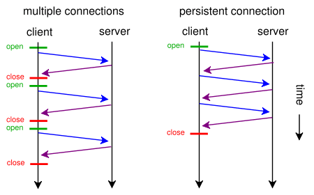
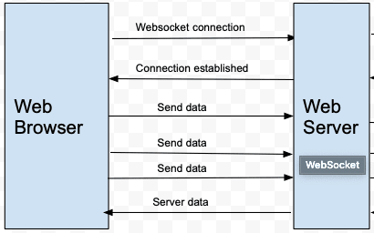
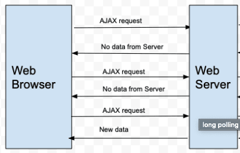

# websocket

## http Keep-Alive模式

HTTP有1.1和1.0之說，差別在於keep-alive，即把多個HTTP請求合並為一個，但是Websocket其實是一個新協定，跟HTTP協定基本沒有關系，只是為了兼容現有瀏覽器的握手規范而已，也就是說它是HTTP協定上的一種補充。

首先，Websocket是一個持久化的協定，相對於HTTP這種非持久的協議來說。簡單的舉個例子吧， HTTP的生命週期通過Request來界定，也就是一個Request 一個Response，那麼在HTTP1.0中，這次HTTP請求就結束了。

HTTP協議採用“請求-應答”模式，當使用普通模式，即非KeepAlive模式時，每個請求/應答客戶和服務器都要新建一個連接，完成之後立即斷開連接，因為HTTP協議為無連接的協議；當使用Keep-Alive模式（HTTP 1.1，又稱持久連接、連接重用）時，Keep-Alive功能使客戶端到服務器端的連接持續有效，當出現對服務器的後繼請求時，Keep-Alive功能避免了建立或者重新建立連接。目前大部分瀏覽器都是用HTTP 1.1協議，也就是說預設都會發起Keep-Alive的連接請求了，所以是否能完成一個完整的Keep- Alive連接就看服務器設置情況。



## websocket

首先Websocket是基於HTTP協定的，或者說借用了HTTP的協定來完成一部分握手。

```http
GET /chat HTTP/1.1
Host: server.example.com
Upgrade: websocket
Connection: Upgrade
Sec-WebSocket-Key: x3JJHMbDL1EzLkh9GBhXDw==
Sec-WebSocket-Protocol: chat, superchat
Sec-WebSocket-Version: 13
Origin: http://example.com
```

，這段類似HTTP協定的握手請求中，多了幾個東西。

```http
Upgrade: websocket
Connection: Upgrade
```

這個就是Websocket的核心了，告訴Apache、Nginx等服務器：這次連線使用Websocket協定，快點幫我升級，而不是用HTTP。

```http
Sec-WebSocket-Key: x3JJHMbDL1EzLkh9GBhXDw==
Sec-WebSocket-Protocol: chat, superchat
Sec-WebSocket-Version: 13
```

* Sec-WebSocket-Key 是一個Base64 encode的值，這個是瀏覽器隨機生成的，告訴服務器：我要驗證主機是不是支援Websocket協定。
* Sec\_WebSocket-Protocol 是一個用戶定義的字串，用來區分同URL下，不同的服務所需要的協定。
* Sec-WebSocket-Version 是告訴服務器所使用的Websocket Draft（協議版本），在最初的時候，Websocket協議還在 Draft 階段，現在大家都使用版本13。

然後服務器會返回下列東西，表示已經接受到請求， 成功建立Websocket。

```http
HTTP/1.1 101 Switching Protocols
Upgrade: websocket
Connection: Upgrade
Sec-WebSocket-Accept: HSmrc0sMlYUkAGmm5OPpG2HaGWk=
Sec-WebSocket-Protocol: chat
```

這裡開始就是HTTP最後負責的區域了，告訴客戶，我已經成功切換協定了。

然後，Sec-WebSocket-Accept 這個則是經過服務器確認，並且加密過後的 Sec-WebSocket-Key。服務器：好啦好啦，知道啦，給你看我的ID CARD來證明行了吧。。後面的，Sec-WebSocket-Protocol 則是表示最終使用的協議。至此，HTTP已經完成它所有工作了，接下來就是完全按照Websocket協議進行了。



## 輪詢 \(Polling\)

這是早期Web的一種解決方式，透過Client端在一定的時間間隔下定期去發送request給Server，透過這樣頻繁發送請求來保持資料的同步，但也因此會耗費Client大量的傳輸消耗。




