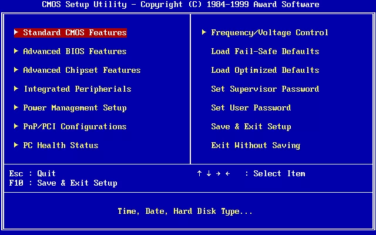
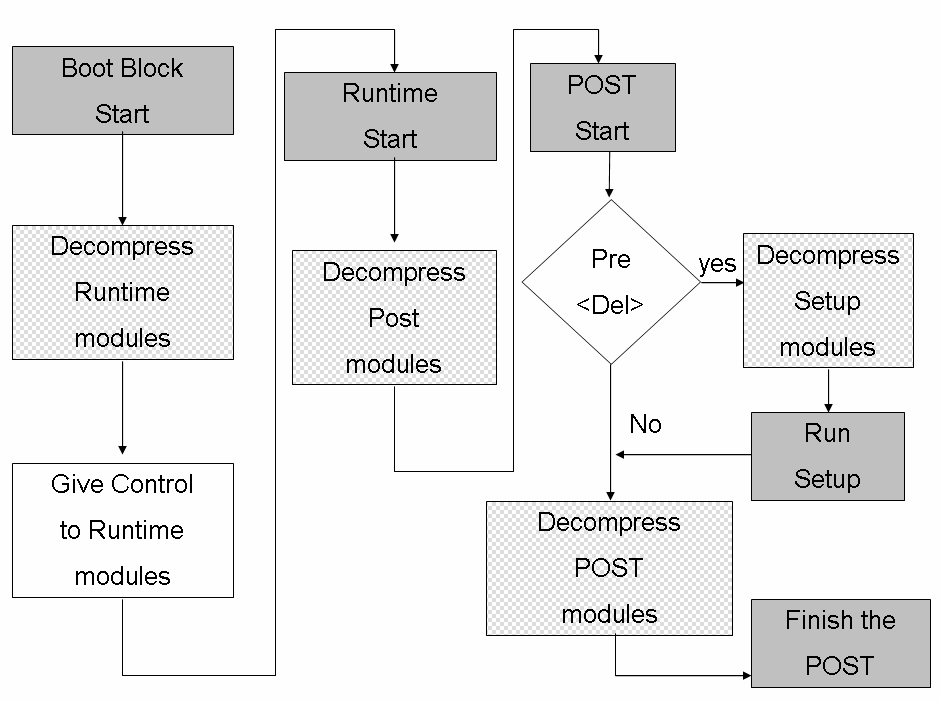

# BIOS

## 簡介

當電腦開機時，CPU從主機板的BIOS晶片內取得程式，由BIOS內部的程式獲得硬體控制權並作用，從CPU內外部檢測設置，啟動DRAM，以及針對晶片組與外部設備作初始化設置後，最後驅動硬碟直到作業系統加載成功，BIOS的工作交棒給作業系統的bootloader後工作完成。

BIOS平時儲存於ROM中\(EPROM或FLASH\)，除了特殊工具和方法之外，任何應用程式無法對BIOS進行修改或刪除。

對於新的CPU硬體，BIOS為了相容性，通常會使用CPUID的功能調整部份功能，其餘大部份程式碼不需修改即可使用。

## BIOS韌體

BOOT是載入執行的一個預啟動的操作環境程式，嚴格來算是軟體，通常用組合語言編寫。是一組固化到計算機內主機板上一個ROM晶片上的程式。它儲存著計算機最重要的基本輸入輸出的程式、系統設定資訊、開機後自檢程式和系統自啟動程式。其主要功能是為計算機提供最底層的、最直接的硬體設定和控制。

一般稱BIOS是指主機板的BIOS，而其它的週邊也有自已的BIOS ROM，像是顯示卡、高階網路卡等，因為較複雜的外接週邊硬體設計差異很大，各自有其獨特初始動作，所以廠商會另外加上BIOS ROM。

然而，不適當的執行或是終止 BIOS 更新可能導致電腦或是裝置的不堪使用。為了避免 BIOS 損壞，有些新的主機板有備份的 BIOS \("雙BIOS"主機板\)，主要是因為CIH病毒可破壞BIOS。

當PC開機，BIOS 是由電路板上的ROM執行，並且他將晶片組和記憶體子系統順序起始化。他把自己從ROM中解壓縮到系統的主記憶體，並且從那邊開始執行。PC 的 BIOS 程式碼也包含診斷功能，以保證某些重要硬體元件的正確，像是鍵盤，磁碟裝置，輸出輸入埠等等，這些可以正常運作且正常地初始化。幾乎所有的 BIOS 都可以選擇性地執行 CMOS 記憶體的設定程式; 也就是儲存 BIOS 會存取的使用者自訂設定資料\(時間、日期、硬碟細節，等等\)。

現在的新式電腦用的基本都是UEFI啟動，早期的過渡電腦用的都是EFI啟動。其實EFI或UEFI的一部分也是儲存在一個晶片中，由於它們在表面形式、基本功能上和BIOS差不多，所以習慣上我們也把儲存EFI/UEFI的晶片叫做EFI/UEFI BIOS晶片，EFI/UEFI也叫做EFI/UEFI BIOS，但在實際上它們和BIOS根本是不一樣的設計。

## BIOS主要功能

BIOS用於**硬體自檢 \(power on self test, POST\)**、**CMOS設定**、**引導作業系統啟動**、**提供硬體I/O**、硬體中斷等4項主要功能，

因此BIOS程式可以分為若干模組，主要有Boot Block引導模組、CMOS設定模組、擴充套件配置資料（ESCD）模組、DMI收集硬體資料模組。

其中引導模組直接負責執行BIOS程式本身入口、電腦基本硬體的檢測和初始化，ESCD用於BIOS與OS交換硬體配置資料，DMI則充當了硬體管理工具和系統層之間介面的角色，通過DMI，使用者可以直觀地獲得硬體的任何資訊，CMOS設定模組就是實現對硬體資訊進行設定，並儲存在CMOS中，是除了啟動初始化以外BIOS程式最常用的功能。

## BIOS設置

BIOS的設定值，是儲存在主機板上的CMOS晶片，此晶片以主機板上的鋰電池供電。現代主機板將CMOS整合到南橋晶片或Super IO晶片

## x86真實模式下的記憶體佈局

BIOS本身是組合語言程式碼，是在16位元真實模式下呼叫INT 13H中斷執行的。由於x86-64是一個高度相容的指令集，也為了遷就BIOS的16位元真實模式的執行環境，所以即使現在的CPU都已是64位元，還是在BIOS啟動（常見於09年以前的主機板），在開機時仍然都是在16位真實模式下執行的。16位真實模式直接能訪問的記憶體只有1MB。

在這1MB記憶體中，頂層640K稱為基本記憶體，後面384K記憶體留給開機必要硬體和各類BIOS本身使用。

相容x86的CPU\(如AMD，cyrix\)在BIOS設置或設置上有相似的配置。

| 起始 | 結束 | 大小 | 用途 |
| :--- | :--- | :--- | :--- |
| FFFF0 | FFFFF | 16 Bytes | BIOS入口地址，此地址也屬於BIOS程式碼，同樣屬於頂部的64 KB位元組。只是為了強調入口地址才單獨寫出。此處16位元組的內容是跳轉指令 `JMP F000:E05B`。 |
| F0000 | FFFEF | 64KB~16B | 系統BIOS的範圍是F0000~FFFFF共640 KB，為了說明入口地址，將最上面的16 Bytes從此處扣除，所以結束地址是FFFEF。 |
| C8000 | EFFFF | 160KB | 映射硬體配接器的ROM或是記憶體映射的I/O |
| C0000 | C7FFF | 32KB | 顯示配接器BIOS |
| B8000 | BFFFF | 32KB | 文字模式顯示的配接器 |
| B0000 | B7FFF | 32KB | 用於黑白顯示配接器\(通常保留未用\) |
| A0000 | AFFFF | 64KB | 用於彩色顯示配接器\(VGA\) |
| 9FC00 | 9FFFF | 1KB | EBDA \(extended BIOS data area\) |
| 7E00 | 9EBFF | 約608KB | 可用區域 |
| 7C00 | 7DFF | 512B | MBR被BIOS加載到此處，共512B |
| 500 | 7BFF | 約30KB | 可用區域 |
| 400 | 4FF | 256B | BIOS data area |
| 000 | 3FF | 1KB | Interrupt Vector Table\(中斷向量表\) |

## BIOS啟動流程

1. 系統開機後，第一步通電自檢（Power On Self Test, POST）。
2. POST過後初始化用於啟動的硬體（磁碟、鍵盤控制器等）。
3. BIOS會執行BIOS磁碟啟動順序中第一個磁碟的首440bytes（MBR啟動程式碼區域）內的程式碼。
4. 啟動引導程式碼從BIOS獲得控制權，然後引導啟動下一階段的程式碼（如果有的話）（一般是系統的啟動引導程式碼）。
5. 再次被啟動的程式碼（二階段程式碼）（即啟動引導）會查閱支援和配置檔案。
6. 根據配置檔案中的資訊，啟動載入程式會將核心和initramfs檔案載入系統的RAM中，然後開始啟動核心。

硬體初始化工作中，主要說明兩點，首先經過POST檢測後，電腦終於出現了開機啟動畫面，這就是已經檢測到了顯示卡並完成了初始化。但是請注意，由於BIOS是在16位真實模式執行，因此該畫面是以VGA解析度（640\*480，縱橫比4:3）顯示的，因為真實模式最高支援的就是VGA。

BIOS只識別到由主開機記錄（MBR）初始化的硬碟，之所以說明這點，是因為後續的EFI或UEFI採用了一種新的GUID磁碟分割槽系統（GPT）格式，這種硬碟在BIOS下是無法識別的。硬體全部初始化完畢後，接下來進入更新ESCD階段。

在ESCD更新階段中，BIOS將對儲存在CMOS中和作業系統交換的硬體配置資料進行檢測，如果系統硬體發生變動，則會更新該資料，否則不更新保持原狀不變，ESCD檢測或更新結束後，BIOS將完成最後一項工作，就是啟動作業系統。

最後這一步中，BIOS根據CMOS中使用者指定的硬體啟動順序，讀取相應裝置的啟動或引導記錄，引導相應裝置上的作業系統啟動，進入作業系統，此後便由作業系統接替BIOS負責硬體和軟體間的相互通訊。如果發現所有硬體都沒有能引導作業系統的記錄，則會在螢幕上顯示相應錯誤資訊，並將電腦維持在16位真實模式。

## BIOS 中斷向量表 \(interrupt vector table\)

<table>
  <thead>
    <tr>
      <th style="text-align:left">&#x4E2D;&#x65B7;&#x7DE8;&#x78BC;</th>
      <th style="text-align:left">&#x63CF;&#x8FF0;</th>
    </tr>
  </thead>
  <tbody>
    <tr>
      <td style="text-align:left">INT 00h</td>
      <td style="text-align:left">CPU&#xFF1A;&#x9664;&#x4EE5;&#x96F6;&#x932F;&#xFF0C;&#x6216;&#x5546;&#x4E0D;&#x5408;&#x6CD5;&#x6642;&#x89F8;&#x767C;
         &#x3002;</td>
    </tr>
    <tr>
      <td style="text-align:left">INT 01h</td>
      <td style="text-align:left">CPU&#xFF1A;&#x55AE;&#x6B65;&#x9677;&#x9631;&#xFF0C;TF&#x6A19;&#x8A18;&#x70BA;&#x6253;&#x958B;&#x72C0;&#x614B;&#x6642;&#xFF0C;&#x6BCF;&#x689D;&#x6307;&#x4EE4;&#x57F7;&#x884C;&#x5F8C;&#x89F8;&#x767C;
         &#x3002;</td>
    </tr>
    <tr>
      <td style="text-align:left">INT 02h</td>
      <td style="text-align:left">CPU&#xFF1A;&#x975E;&#x53EF;&#x5C01;&#x9396;&#x4E2D;&#x65B7;&#xFF0C;&#x5982;&#x555F;&#x52D5;&#x81EA;&#x6211;&#x6E2C;&#x8A66;&#x6642;&#x767C;&#x751F;&#x8A18;&#x61B6;&#x9AD4;&#x932F;&#x8AA4;&#x3002;</td>
    </tr>
    <tr>
      <td style="text-align:left">INT 03h</td>
      <td style="text-align:left">CPU&#xFF1A;&#x7B2C;&#x4E00;&#x500B;&#x672A;&#x5B9A;&#x7FA9;&#x7684;&#x4E2D;&#x65B7;&#x5411;&#x91CF;&#xFF0C;&#x7D04;&#x5B9A;&#x4FD7;&#x6210;&#x50C5;&#x7528;&#x65BC;&#x9664;&#x932F;&#x7A0B;&#x5F0F;
         &#x3002;</td>
    </tr>
    <tr>
      <td style="text-align:left">INT 04h</td>
      <td style="text-align:left">CPU&#xFF1A;&#x7B97;&#x6578;&#x6EA2;&#x4F4D;&#x3002;&#x901A;&#x5E38;&#x7531;INTO&#x6307;&#x4EE4;&#x5728;&#x7F6E;&#x6EA2;&#x4F4D;&#x4F4D;&#x6642;&#x89F8;&#x767C;&#x3002;
         
      </td>
    </tr>
    <tr>
      <td style="text-align:left">INT 05h</td>
      <td style="text-align:left">&#x5728;&#x6309;&#x4E0B;Shift-Print Screen&#x6216;BOUND&#x6307;&#x4EE4;&#x6AA2;&#x6E2C;&#x5230;&#x7BC4;&#x570D;&#x7570;&#x5E38;&#x6642;&#x89F8;&#x767C;&#x3002;
         
      </td>
    </tr>
    <tr>
      <td style="text-align:left">INT 06h</td>
      <td style="text-align:left">CPU&#xFF1A;&#x975E;&#x6CD5;&#x6307;&#x4EE4;&#x3002;
         
      </td>
    </tr>
    <tr>
      <td style="text-align:left">INT 07h</td>
      <td style="text-align:left">CPU&#xFF1A;&#x6C92;&#x6709;&#x6578;&#x5B78;&#x5354;&#x8655;&#x7406;&#x5668;&#x6642;&#x5617;&#x8A66;&#x57F7;&#x884C;&#x6D6E;&#x9EDE;&#x6307;&#x4EE4;&#x89F8;&#x767C;&#x3002;
         
      </td>
    </tr>
    <tr>
      <td style="text-align:left">INT 08h</td>
      <td style="text-align:left">IRQ0&#xFF1A;&#x53EF;&#x7A0B;&#x5F0F;&#x5316;&#x4E2D;&#x65B7;&#x63A7;&#x5236;&#x5668;&#x6BCF;
        55 &#x6BEB;&#x79D2;&#x89F8;&#x767C;&#x4E00;&#x6B21;&#xFF0C;&#x5373;&#x6BCF;&#x79D2;
        18.2 &#x6B21;&#x3002;
         
      </td>
    </tr>
    <tr>
      <td style="text-align:left">INT 09h</td>
      <td style="text-align:left">IRQ1&#xFF1A;&#x6BCF;&#x6B21;&#x9375;&#x76E4;&#x6309;&#x4E0B;&#x3001;&#x6309;&#x4F4F;&#x3001;&#x91CB;&#x653E;&#x3002;
         
      </td>
    </tr>
    <tr>
      <td style="text-align:left">INT 0Ah</td>
      <td style="text-align:left">IRQ2&#xFF1A;
         
      </td>
    </tr>
    <tr>
      <td style="text-align:left">INT 0Bh</td>
      <td style="text-align:left">IRQ3&#xFF1A;COM2/COM4&#x3002;
         
      </td>
    </tr>
    <tr>
      <td style="text-align:left">INT 0Ch</td>
      <td style="text-align:left">IRQ4&#xFF1A;COM1/COM3&#x3002;
         
      </td>
    </tr>
    <tr>
      <td style="text-align:left">INT 0Dh</td>
      <td style="text-align:left">IRQ5&#xFF1A;&#x786C;&#x789F;&#x63A7;&#x5236;&#x5668;&#xFF08;PC/XT &#x4E0B;&#xFF09;&#x6216;&#xA0;LPT2&#x3002;</td>
    </tr>
    <tr>
      <td style="text-align:left">INT 0Eh</td>
      <td style="text-align:left">IRQ6&#xFF1A;&#x9700;&#x8981;&#x6642;&#x7531;&#x8EDF;&#x789F;&#x63A7;&#x5236;&#x5668;&#x547C;&#x53EB;&#x3002;
         
      </td>
    </tr>
    <tr>
      <td style="text-align:left">INT 0Fh</td>
      <td style="text-align:left">IRQ7&#xFF1A;LPT1&#x3002;
         
      </td>
    </tr>
    <tr>
      <td style="text-align:left">INT 10h</td>
      <td style="text-align:left">
        
&#x986F;&#x793A;&#x670D;&#x52D9; - &#x7531;BIOS&#x6216;&#x4F5C;&#x696D;&#x7CFB;&#x7D71;&#x8A2D;&#x5B9A;&#x4EE5;&#x4F9B;&#x8EDF;&#x9AD4;&#x547C;&#x53EB;&#x3002;
           
        

        <ul>
          <li>AH=00h
             &#xFF1A;&#x8A2D;&#x5B9A;&#x986F;&#x793A;&#x6A21;&#x5F0F;</li>
          <li>AH=01h
             &#xFF1A;&#x8A2D;&#x5B9A;&#x6E38;&#x6A19;&#x5F62;&#x614B;
             
          </li>
          <li>AH=02h
             &#xFF1A;&#x8A2D;&#x5B9A;&#x6E38;&#x6A19;&#x4F4D;&#x7F6E;
             
          </li>
          <li>AH=03h
             &#xFF1A;&#x53D6;&#x5F97;&#x6E38;&#x6A19;&#x4F4D;&#x7F6E;&#x8207;&#x5F62;&#x614B;
             
          </li>
          <li>AH=04h
             &#xFF1A;&#x53D6;&#x5F97;&#x6E38;&#x6A19;&#x4F4D;&#x7F6E;
             
          </li>
          <li>AH=05h
             &#xFF1A;&#x8A2D;&#x5B9A;&#x986F;&#x793A;&#x9801;
             
          </li>
          <li>AH=06h
             &#xFF1A;&#x6E05;&#x9664;&#x6216;&#x6372;&#x8EF8;&#x756B;&#x9762;(&#x4E0A;)
             
          </li>
          <li>AH=07h
             &#xFF1A;&#x6E05;&#x9664;&#x6216;&#x6372;&#x8EF8;&#x756B;&#x9762;(&#x4E0B;)
             
          </li>
          <li>AH=08h
             &#xFF1A;&#x8B80;&#x53D6;&#x6E38;&#x6A19;&#x8655;&#x5B57;&#x5143;&#x8207;&#x5C6C;&#x6027;
             
          </li>
          <li>AH=09h
             &#xFF1A;&#x66F4;&#x6539;&#x6E38;&#x6A19;&#x8655;&#x5B57;&#x5143;&#x8207;&#x5C6C;&#x6027;
             
          </li>
          <li>AH=0Ah
             &#xFF1A;&#x66F4;&#x6539;&#x6E38;&#x6A19;&#x8655;&#x5B57;&#x5143;
             
          </li>
          <li>AH=0Bh
             &#xFF1A;&#x8A2D;&#x5B9A;&#x908A;&#x754C;&#x984F;&#x8272;
             
          </li>
          <li>AH=0Eh
             &#xFF1A;&#x5728;TTY&#x6A21;&#x5F0F;&#x4E0B;&#x5BEB;&#x5B57;&#x5143;
             
          </li>
          <li>AH=0Fh
             &#xFF1A;&#x53D6;&#x5F97;&#x76EE;&#x524D;&#x986F;&#x793A;&#x6A21;&#x5F0F;
             
          </li>
          <li>AH=13h
             &#xFF1A;&#x5BEB;&#x5B57;&#x4E32;
             
          </li>
        </ul>
      </td>
    </tr>
    <tr>
      <td style="text-align:left">INT 11h</td>
      <td style="text-align:left">&#x8FD4;&#x56DE;&#x88DD;&#x7F6E;&#x5217;&#x8868;&#x3002;</td>
    </tr>
    <tr>
      <td style="text-align:left">INT 12h</td>
      <td style="text-align:left">&#x53D6;&#x5F97;&#x5E38;&#x898F;&#x8A18;&#x61B6;&#x9AD4;&#x5BB9;&#x91CF;&#x3002;
         
      </td>
    </tr>
    <tr>
      <td style="text-align:left">INT 13h</td>
      <td style="text-align:left">
        
&#x4F4E;&#x968E;&#x78C1;&#x789F;&#x670D;&#x52D9;&#x3002;
           
        

        <ul>
          <li>AH=00h&#xFF1A;&#x5FA9;&#x4F4D;&#x78C1;&#x789F;&#x6A5F;&#x3002;
             
          </li>
          <li>AH=01h&#xFF1A;&#x6AA2;&#x67E5;&#x78C1;&#x789F;&#x6A5F;&#x72C0;&#x614B;&#x3002;
             
          </li>
          <li>AH=02h&#xFF1A;&#x8B80;&#x78C1;&#x5340;&#x3002;
             
          </li>
          <li>AH=03h&#xFF1A;&#x5BEB;&#x78C1;&#x5340;&#x3002;
             
          </li>
          <li>AH=04h&#xFF1A;&#x6821;&#x9A57;&#x78C1;&#x5340;&#x3002;
             
          </li>
          <li>AH=05h&#xFF1A;&#x683C;&#x5F0F;&#x5316;&#x78C1;&#x8ECC;&#x3002;
             
          </li>
          <li>AH=08h&#xFF1A;&#x53D6;&#x5F97;&#x9A45;&#x52D5;&#x5668;&#x5F15;&#x6578;&#x3002;
             
          </li>
          <li>AH=09h&#xFF1A;&#x521D;&#x59CB;&#x5316;&#x786C;&#x789F;&#x6A5F;&#x5F15;&#x6578;&#x3002;
             
          </li>
          <li>AH=0Ch&#xFF1A;&#x5C0B;&#x9053;&#x3002;
             
          </li>
          <li>AH=0Dh&#xFF1A;&#x5FA9;&#x4F4D;&#x786C;&#x789F;&#x63A7;&#x5236;&#x5668;&#x3002;
             
          </li>
          <li>AH=15h&#xFF1A;&#x53D6;&#x5F97;&#x9A45;&#x52D5;&#x5668;&#x578B;&#x5225;&#x3002;
             
          </li>
          <li>AH=16h&#xFF1A;&#x53D6;&#x5F97;&#x8EDF;&#x789F;&#x6A5F;&#x4E2D;&#x789F;&#x7247;&#x7684;&#x72C0;&#x614B;&#x3002;
             
          </li>
        </ul>
      </td>
    </tr>
    <tr>
      <td style="text-align:left">INT 14h</td>
      <td style="text-align:left">
        
&#x5E8F;&#x5217;&#x57E0;&#x901A;&#x8A0A;&#x5E38;&#x5F0F;&#x3002;
           
        

        <ul>
          <li>AH=00h&#xFF1A;&#x521D;&#x59CB;&#x5316;&#x5E8F;&#x5217;&#x57E0;&#x3002;
             
          </li>
          <li>AH=01h&#xFF1A;&#x5BEB;&#x51FA;&#x5B57;&#x5143;&#x3002;
             
          </li>
          <li>AH=02h&#xFF1A;&#x8B80;&#x5165;&#x5B57;&#x5143;&#x3002;
             
          </li>
          <li>AH=03h&#xFF1A;&#x72C0;&#x614B;&#x3002;
             
          </li>
        </ul>
      </td>
    </tr>
    <tr>
      <td style="text-align:left">INT 15h</td>
      <td style="text-align:left">
        
&#x5176;&#x5B83;&#xFF08;&#x7CFB;&#x7D71;&#x652F;&#x63F4;&#x5E38;&#x5F0F;&#xFF09;&#x3002;
           
        

        <ul>
          <li>AH=4Fh&#xFF1A;&#x9375;&#x76E4;&#x6514;&#x622A;&#x3002;
             
          </li>
          <li>AH=83h&#xFF1A;&#x4E8B;&#x4EF6;&#x7B49;&#x5F85;&#x3002;
             
          </li>
          <li>AH=84h&#xFF1A;&#x8B80;&#x904A;&#x6232;&#x687F;&#x3002;
             
          </li>
          <li>AH=85h&#xFF1A;SysRq &#x9375;&#x3002;
             
          </li>
          <li>AH=86h&#xFF1A;&#x7B49;&#x5F85;&#x3002;
             
          </li>
          <li>AH=87h&#xFF1A;&#x584A;&#x79FB;&#x52D5;&#x3002;
             
          </li>
          <li>AH=88h&#xFF1A;&#x53D6;&#x5F97;&#x64F4;&#x5145;&#x8A18;&#x61B6;&#x9AD4;&#x5BB9;&#x91CF;&#x3002;
             
          </li>
          <li>AH=C0h&#xFF1A;&#x53D6;&#x5F97;&#x7CFB;&#x7D71;&#x5F15;&#x6578;&#x3002;
             
          </li>
          <li>AH=C1h&#xFF1A;&#x53D6;&#x5F97;&#x64F4;&#x5145; BIOS &#x8CC7;&#x6599;&#x5340;&#x6BB5;&#x3002;
             
          </li>
          <li>AH=C2h&#xFF1A;&#x6307;&#x6A19;&#x88DD;&#x7F6E;&#x529F;&#x80FD;&#x3002;
             
          </li>
          <li>AH=E8h, AL=01h (AX = E801h)&#xFF1A;&#x53D6;&#x5F97;&#x64F4;&#x5145;&#x8A18;&#x61B6;&#x9AD4;&#x5BB9;&#x91CF;&#xFF08;&#x81EA;&#x5F9E;
            1994 &#x5E74;&#x5F15;&#x5165;&#x7684;&#x65B0;&#x529F;&#x80FD;&#xFF09;&#xFF0C;&#x53EF;&#x53D6;&#x5F97;&#x5230;
            64MB &#x4EE5;&#x4E0A;&#x7684;&#x8A18;&#x61B6;&#x9AD4;&#x5BB9;&#x91CF;&#x3002;
             
          </li>
          <li>AH=E8h, AL=20h (AX = E820h) &#x67E5;&#x8A62;&#x7CFB;&#x7D71;&#x4F4D;&#x5740;&#x5C0D;&#x6620;&#x3002;&#x8A72;&#x529F;&#x80FD;&#x53D6;&#x4EE3;&#x4E86;
            AX=E801h &#x548C; AH=88h&#x3002;
             
          </li>
        </ul>
      </td>
    </tr>
    <tr>
      <td style="text-align:left">INT 16h</td>
      <td style="text-align:left">
        
&#x9375;&#x76E4;&#x901A;&#x8A0A;&#x5E38;&#x5F0F;&#x3002;
           
        

        <ul>
          <li>AH=00h&#xFF1A;&#x8B80;&#x5B57;&#x5143;&#x3002;
             
          </li>
          <li>AH=01h&#xFF1A;&#x8B80;&#x8F38;&#x5165;&#x72C0;&#x614B;&#x3002;
             
          </li>
          <li>AH=02h&#xFF1A;&#x8B80; Shift &#x9375;&#xFF08;&#x4FEE;&#x6539;&#x9375;&#xFF09;&#x72C0;&#x614B;&#x3002;
             
          </li>
          <li>AH=10h&#xFF1A;&#x8B80;&#x5B57;&#x5143;&#xFF08;&#x589E;&#x5F37;&#x7248;&#xFF09;&#x3002;
             
          </li>
          <li>AH=11h&#xFF1A;&#x8B80;&#x8F38;&#x5165;&#x72C0;&#x614B;&#xFF08;&#x589E;&#x5F37;&#x7248;&#xFF09;&#x3002;
             
          </li>
          <li>AH=12h&#xFF1A;&#x8B80; Shift &#x9375;&#xFF08;&#x4FEE;&#x6539;&#x9375;&#xFF09;&#x72C0;&#x614B;&#xFF08;&#x589E;&#x5F37;&#x7248;&#xFF09;&#x3002;
             
          </li>
        </ul>
      </td>
    </tr>
    <tr>
      <td style="text-align:left">INT 17h</td>
      <td style="text-align:left">
        
&#x5217;&#x5370;&#x670D;&#x52D9;&#x3002;
           
        

        <ul>
          <li>AH=00h&#xFF1A;&#x5217;&#x5370;&#x5B57;&#x5143;&#x3002;
             
          </li>
          <li>AH=01h&#xFF1A;&#x521D;&#x59CB;&#x5316;&#x5370;&#x8868;&#x6A5F;&#x3002;
             
          </li>
          <li>AH=02h&#xFF1A;&#x6AA2;&#x67E5;&#x5370;&#x8868;&#x6A5F;&#x72C0;&#x614B;&#x3002;
             
          </li>
        </ul>
      </td>
    </tr>
    <tr>
      <td style="text-align:left">INT 18h</td>
      <td style="text-align:left">&#x57F7;&#x884C;&#x78C1;&#x5E36;&#x4E0A;&#x7684; BASIC &#x7A0B;&#x5F0F;&#xFF1A;&#x300C;&#x771F;&#x6B63;&#x7684;&#x300D;IBM
        &#x76F8;&#x5BB9;&#x6A5F;&#x5728; ROM &#x88E1;&#x5167;&#x5EFA; BASIC &#x7A0B;&#x5F0F;&#xFF0C;&#x7576;&#x555F;&#x52D5;&#x5931;&#x6557;&#x6642;&#x7531;
        BIOS &#x547C;&#x53EB;&#x6B64;&#x5E38;&#x5F0F;&#x89E3;&#x91CB;&#x57F7;&#x884C;&#x3002;&#xFF08;&#x4F8B;&#xFF1A;&#x5217;&#x5370;&#x300C;Boot
        disk error. Replace disk and press any key to continue...&#x300D;&#x9019;&#x985E;&#x63D0;&#x793A;&#x8CC7;&#x8A0A;&#xFF09;
         
      </td>
    </tr>
    <tr>
      <td style="text-align:left">INT 19h</td>
      <td style="text-align:left">&#x52A0;&#x96FB;&#x81EA;&#x6AA2;&#x4E4B;&#x5F8C;&#x8F09;&#x5165;&#x4F5C;&#x696D;&#x7CFB;&#x7D71;&#x3002;</td>
    </tr>
    <tr>
      <td style="text-align:left">INT 1Ah</td>
      <td style="text-align:left">
        
&#x6642;&#x937E;&#x670D;&#x52D9;&#x3002;
           
        

        <ul>
          <li>AH=00h&#xFF1A;&#x8B80;&#x53D6;&#x5373;&#x6642;&#x937E;&#x3002;
             
          </li>
          <li>AH=01h&#xFF1A;&#x8A2D;&#x5B9A;&#x5373;&#x6642;&#x937E;&#x3002;
             
          </li>
          <li>AH=02h&#xFF1A;&#x8B80;&#x53D6;&#x5373;&#x6642;&#x937E;&#x6642;&#x9593;&#x3002;
             
          </li>
          <li>AH=03h&#xFF1A;&#x8A2D;&#x5B9A;&#x5373;&#x6642;&#x937E;&#x6642;&#x9593;&#x3002;
             
          </li>
          <li>AH=04h&#xFF1A;&#x8B80;&#x53D6;&#x5373;&#x6642;&#x937E;&#x65E5;&#x671F;&#x3002;
             
          </li>
          <li>AH=05h&#xFF1A;&#x8A2D;&#x5B9A;&#x5373;&#x6642;&#x937E;&#x65E5;&#x671F;&#x3002;
             
          </li>
          <li>AH=06h&#xFF1A;&#x8A2D;&#x5B9A;&#x5373;&#x6642;&#x937E;&#x9B27;&#x9234;&#x3002;
             
          </li>
          <li>AH=07h&#xFF1A;&#x91CD;&#x8A2D;&#x5373;&#x6642;&#x937E;&#x9B27;&#x9234;&#x3002;</li>
        </ul>
      </td>
    </tr>
    <tr>
      <td style="text-align:left">INT 1Bh</td>
      <td style="text-align:left">Ctrl+Break&#xFF0C;&#x7531; IRQ 9 &#x81EA;&#x52D5;&#x547C;&#x53EB;&#x3002;
         
      </td>
    </tr>
    <tr>
      <td style="text-align:left">INT 1Ch</td>
      <td style="text-align:left">&#x9810;&#x7559;&#xFF0C;&#x7531; IRQ 8 &#x81EA;&#x52D5;&#x547C;&#x53EB;&#x3002;</td>
    </tr>
    <tr>
      <td style="text-align:left">INT 1Dh</td>
      <td style="text-align:left">&#x4E0D;&#x53EF;&#x547C;&#x53EB;&#xFF1A;&#x6307;&#x5411;&#x5F71;&#x7247;&#x5F15;&#x6578;&#x5217;&#xFF08;&#x5305;&#x542B;&#x5F71;&#x7247;&#x6A21;&#x5F0F;&#x7684;&#x8CC7;&#x6599;&#xFF09;&#x7684;&#x6307;&#x6A19;&#x3002;
         
      </td>
    </tr>
    <tr>
      <td style="text-align:left">INT 1Eh</td>
      <td style="text-align:left">&#x4E0D;&#x53EF;&#x547C;&#x53EB;&#xFF1A;&#x6307;&#x5411;&#x8EDF;&#x789F;&#x6A21;&#x5F0F;&#x8868;&#xFF08;&#x5305;&#x542B;&#x95DC;&#x65BC;&#x8EDF;&#x789F;&#x6A5F;&#x7684;&#x5927;&#x91CF;&#x8CC7;&#x8A0A;&#xFF09;&#x7684;&#x6307;&#x6A19;&#x3002;
         
      </td>
    </tr>
    <tr>
      <td style="text-align:left">INT 1Fh</td>
      <td style="text-align:left">&#x4E0D;&#x53EF;&#x547C;&#x53EB;&#xFF1A;&#x6307;&#x5411;&#x5F71;&#x7247;&#x5716;&#x5F62;&#x5B57;&#x5143;&#x8868;&#xFF08;&#x5305;&#x542B;&#x5F9E;
        80h &#x5230; FFh &#x7684;&#xA0;ASCII&#xA0;&#x5B57;&#x5143;&#x7684;&#x8CC7;&#x6599;&#xFF09;&#x7684;&#x8CC7;&#x8A0A;&#x3002;
         
      </td>
    </tr>
    <tr>
      <td style="text-align:left">INT 41h</td>
      <td style="text-align:left">&#x4F4D;&#x5740;&#x6307;&#x6A19;&#xFF1A;&#x786C;&#x789F;&#x5F15;&#x6578;&#x5217;&#xFF08;&#x7B2C;&#x4E00;&#x786C;&#x789F;&#xFF09;&#x3002;
         
      </td>
    </tr>
    <tr>
      <td style="text-align:left">INT 46h</td>
      <td style="text-align:left">&#x4F4D;&#x5740;&#x6307;&#x6A19;&#xFF1A;&#x786C;&#x789F;&#x5F15;&#x6578;&#x5217;&#xFF08;&#x7B2C;&#x4E8C;&#x786C;&#x789F;&#xFF09;&#x3002;
         
      </td>
    </tr>
    <tr>
      <td style="text-align:left">INT 4Ah</td>
      <td style="text-align:left">&#x5373;&#x6642;&#x937E;&#x5728;&#x9B27;&#x9234;&#x6642;&#x547C;&#x53EB;&#x3002;
         
      </td>
    </tr>
    <tr>
      <td style="text-align:left">INT 70h</td>
      <td style="text-align:left">IRQ8&#xFF1A;&#x7531;&#x5373;&#x6642;&#x9418;&#x547C;&#x53EB;&#x3002;
         
      </td>
    </tr>
    <tr>
      <td style="text-align:left">INT 74h</td>
      <td style="text-align:left">IRQ12&#xFF1A;&#x7531;&#x6ED1;&#x9F20;&#x547C;&#x53EB;
         
      </td>
    </tr>
    <tr>
      <td style="text-align:left">INT 75h</td>
      <td style="text-align:left">IRQ13&#xFF1A;&#x7531;&#x6578;&#x5B78;&#x5354;&#x8655;&#x7406;&#x5668;&#x547C;&#x53EB;&#x3002;
         
      </td>
    </tr>
    <tr>
      <td style="text-align:left">INT 76h</td>
      <td style="text-align:left">IRQ14&#xFF1A;&#x7531;&#x7B2C;&#x4E00;&#x500B; IDE &#x63A7;&#x5236;&#x5668;&#x6240;&#x547C;&#x53EB;
         &#x3002;</td>
    </tr>
    <tr>
      <td style="text-align:left">INT 77h</td>
      <td style="text-align:left">IRQ15&#xFF1A;&#x7531;&#x7B2C;&#x4E8C;&#x500B; IDE &#x63A7;&#x5236;&#x5668;&#x6240;&#x547C;&#x53EB;
         &#x3002;</td>
    </tr>
  </tbody>
</table>

