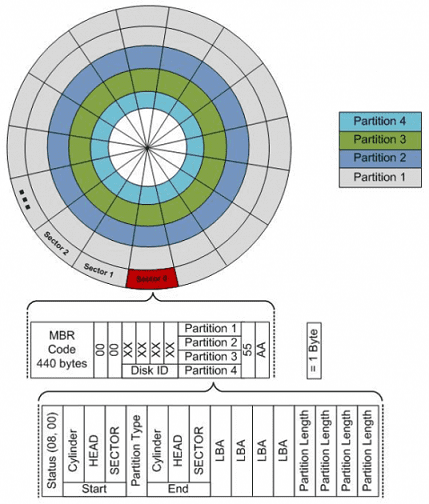

# 開機流程

## 前置知識

學習計算機啟動過程的前置知識是什麼呢？需要已知以下幾點：

* 記憶體是存儲資料的地方，給出一個位址信號，記憶體可以返回該位址所對應的資料。
* CPU 的工作方式就是不斷從記憶體中取出指令並且執行。
* CPU 從記憶體的哪個位址取出指令，是由一個暫存器中的值決定的，這個值會不斷進行 +1 操作\(下一個指令或位元\)，或者由某條跳轉指令指定其值是多少。

## 我們按下開機鍵後究竟發生了什麼？

開機後有四次關鍵跳躍\(jmp\)指令，都是當時 Intel 和 BIOS 等製作廠商的固定下來的流程，記住就好。開機的時候CPU處於真實模式，可定址範圍為1M：

1. 按下開機鍵，CPU 將 PC 暫存器的值強制初始化為 0xFFFF0，這個位置是 BIOS 程式的入口位址（第一次跳躍）
   。
2. 該入口位址處是一個跳轉指令，跳轉到 0xFE05B 位置，開始執行（第二次跳躍）
   。
3. 執行了一些硬體檢測工作後，最後一步將啟動區內容加載（復制）到記憶體 0x7C00，並跳轉到這裡（第三次跳躍）。
4. 啟動區代碼主要是加載作業系統內核，並跳轉到加載處（第四次跳躍）。

經過這連續的四次跳躍，終於來到了作業系統的世界了，剩下的內容，可以說是整個作業系統課程所講述的原理，分段、分頁、建立中斷、裝置驅動、記憶體管理、程式管理、檔案系統、使用者態介面等等。

## 記憶體對映\(memory mapping\)

CPU 位址匯流排的寬度決定了可訪問的記憶體空間的大小。

* 比如 16 位的 CPU 位址總線寬度為 20 條，可定址位址范圍是 $$2^{20} = 1 \ MB$$ 。
* 32 位的 CPU 位址總線寬度為 32 位，位址范圍是 $$2^{20} = 4\ GB$$ 。

可存取的記憶體空間這麼大，並不等於說全都給記憶體使用，也就是說定址的物件不只有記憶體，還有一些外圓設備也要通過位址匯流排的方式去存取。

那怎麼去存取這些外部設備呢？就是在位址范圍中劃出一片片的區域，這塊給視訊記憶體使用，那塊給硬碟控制器使用。我們在相應的位置上讀取或者寫入記憶體，就相當於在視訊記憶體等外設的相應位置上讀取或者寫入，就好像這些外設的儲存區域，被對映到了記憶體中的某一片區域一樣。這樣我們就不用管那些外設啦，關注點仍然是一個簡簡單單的記憶體。這就是所謂的**記憶體對映**。

真實模式時，記憶體的配置如下圖：


記憶體被各種外部設備對映在了記憶體中。BIOS不但其空間被對映到了記憶體 0xC0000 - 0xFFFFF 位置，其裡面的程式還佔用了開頭的一些區域，比如把中斷向量表寫在了記憶體開始的位置。

## BIOS 第一個被執行的部份

目前已經知道 BIOS 裡的資訊被對映到了記憶體 0xC0000 - 0xFFFFF 位置，其中最為關鍵的系統 BIOS 被對映到了 0xF0000 - 0xFFFFF \(16 Bytes\) 位置。

按下開機鍵，CPU 將 PC 暫存器的值強制初始化為 0xFFFF0，這個位址
。更詳細的說，CPU 將段基址暫存器 CS 初始化為 0xF000，將偏移位址暫存器 IP 初始化為 0xFFF0，根據真實模式下的最終位址計算規則，將段基址左移 4 位，加上偏移位址，得到最終的實體位址也就是抽象出來的 PC 暫存器位址為 0xFFFF0。

0xF0000 - 0xFFFFF 只有16位元組，其中儲存的機器指令轉成組合語言是：

```erlang
JMP FAR F000:E05B ; 跳轉到實體位址 0xFE05B 處開始執行
```

位址 0xFE05B 處開始，便是 BIOS 真正發揮作用的程式碼了，這塊程式碼會檢測一些外部設備資訊，並初始化好硬體，建立中斷向量表並填寫中斷例程。這裡的部分不要展開，這只是一段寫死的程式而已，而且對理解開機啟動過程無幫助，後面精彩的部分是 BIOS 的最後一項工作：**載入啟動區**。

載入啟動區是將外部設備啟動區內容加載（復制）到記憶體 0x7C00，並跳轉到這裡。

## 將啟動區複製到記憶體0x7C00位址

BIOS 裡面有一段寫死的程式碼，會幫我們把啟動區的第一扇區的 512 位元組的內容，原封不動複製到記憶體 0x7c00 這個位置，並跳轉到此處。

BIOS 啟動順序的經歷，通常有 USB硬碟啟動、硬碟啟動、軟硬啟動、光碟啟動等等BIOS。 會按照順序，讀取這些啟動盤中位於 0 盤 0 道 1 扇區的內容。

 這 0 盤 0 道 1 扇區的內容一共有 512 個位元組，如果末尾的兩個位元組分別是 0x55 和 0xAA，那麼 BIOS 就會認為它是個啟動區，即所謂的MBR\(master boot record\)。



BIOS 找到了這個啟動區之後，把這 512 個位元組的內容，全部複製到記憶體的 0x7C00位址 。啟動區的內容就是我們自己寫的程式碼了。

複製完成\(512B\)之後，接下來應該是一個跳轉指令。沒錯，正是這樣，PC 暫存器的值變為 0x7c00，指令開始從這裡執行。之後我們的程式就接管了接下來的流程，BIOS 的使命也就結束。

## 為何啟動程式碼是在0x7C00 位址?

正因為 BIOS 將啟動區的程式碼載入到了這裡，因此有了一個偏移量，所以所有寫啟動區程式碼的人就需要在開頭寫死一個這樣的程式碼，不然全都錯位了。

正因為所有寫作業系統的，啟動區的第一行組語程式碼都寫死了這個數字，那 BIOS 開發者最初定的這個數字就不好改。

另一個解釋是第一個 BIOS 開發團隊是 IBM PC 5150 BIOS，當時被認為的第一個作業系統是 DOS 1.0 作業系統，BIOS 團隊就假設是為它服務的。但作業系統還沒出，BIOS 團隊假設其作業系統需要的最小記憶體為 32 KB。BIOS 希望自己所載入的啟動區程式碼盡量靠後，這樣比較“安全”，不至於過早的被其他程式覆蓋掉。可是如果僅僅留 512 位元組又感覺太懸了，還有一些堆疊空間需要預留，那擴大到 1 KB 吧。這樣 32 KB 的末尾是 0x8000，減去 1KB\(0x400\) ，剛好等於 0x7C00。

## QEMU實作啟動區程式

* 機器：用虛擬機器實現（QEMU）
* 硬碟：用虛擬磁碟映像實現（img）
* 寫入資料：用軟體往磁碟映像中寫（dd 命令）

我們只需要編輯一個虛擬磁碟映像檔案，再用 QEMU 啟動一下就好了。這裡我們使用和真正硬碟中資料一一對應的無格式的格式（raw）。該格式中記錄磁碟第一扇區的 512 位元組的位置，就是該檔案從第一個位元組開始往後的 512 位元組。

編輯檔案[mbr.raw](https://github.com/chenhh/cpp-system-dev/blob/master/operating-system/mbr.raw)如下：


```erlang
qemu-system-i386 mbr.raw
或
qemu-system-x86_64 mbr.raw
```

可得結果只有秀出hello。


使用`ndisasm -o0x7c00 mbr.raw` 反組譯\(預設為x86 16-bit\)，且重定位至0x7c00。

```erlang
chenhh@eva00 tmp $ndisasm -o0x7c00 mbr.raw
00007C00  B80006            mov ax,0x600
00007C03  BB0007            mov bx,0x700
00007C06  B90000            mov cx,0x0
00007C09  BA4F18            mov dx,0x184f
00007C0C  CD10              int 0x10
00007C0E  B800B8            mov ax,0xb800
00007C11  8EE8              mov gs,ax
00007C13  65C606000068      mov byte [gs:0x0],0x68
00007C19  65C606020065      mov byte [gs:0x2],0x65
00007C1F  65C60604006C      mov byte [gs:0x4],0x6c
00007C25  65C60606006C      mov byte [gs:0x6],0x6c
00007C2B  65C60608006F      mov byte [gs:0x8],0x6f
00007C31  0000              add [bx+si],al
00007C33  0000              add [bx+si],al
...
00007DF9  0000              add [bx+si],al
00007DFB  0000              add [bx+si],al
00007DFD  0055AA            add [di-0x56],dl
```

0x7C00至0x7C0C呼叫系統中斷清除螢幕。0x7C0E至0x7C2B為輸出hello。

* 第一行就是記憶體位址，第一列 00007C00，對應了之前說的 BIOS 會把啟動區的程式碼加載到記憶體 0x7C00 這個位址。
* 第二行就是機器指令，對比上面的二進制檔案，我們可以看到他們是一一對應的。
* 第三行就是反編譯出來的組語指令：第一部分是一段清除螢幕指令的程式碼，不然螢幕會亂糟糟出現 QEMU 本身的 bios 輸出。第二部分就是為什麼能在螢幕上列印出 hello。第三部分都是 0，其實這不是指令，但如果硬要給他解讀成指令也是可以的。

### 使用組合語言編譯MBR

```cpp
; nasm -o mbr.bin mbr.asm
;----BIOS把啟動區加載到記憶體的該位置，所以需設置位址偏移量
section mbr vstart=0x7c00

;----螢幕中斷，目的是清除螢幕
mov ax,0x0600
mov bx,0x0700
mov cx,0
mov dx,0x184f
int 0x10

;----直接往顯示記憶體中寫資料
mov ax,0xb800
mov gs,ax
mov byte [gs:0x00],'h'
mov byte [gs:0x02],'e'
mov byte [gs:0x04],'l'
mov byte [gs:0x06],'l'
mov byte [gs:0x08],'o'

;----512字節的最後兩位元是啟動區標識
times 510-($-$$) db 0
db 0x55,0xaa
```

執行命令`nasm -o mbr.bin mbr.asm`，可以看到檔案夾下多了一個叫 `mbr.bin` 的檔案，其內容與mbr.raw一致。

使用QEMU建立一個空的虛擬硬碟，再將編譯出來的`mbr.bin`寫入前512位元組，一樣可開機得到相同的結果。

```bash
# 建立大小為1440K的硬碟
qemu-img create -f raw mbr.raw 1440K

# 將 mbr.bin 檔案的內容，裝載到 mbr.raw 這個空硬碟
# 映像檔案的第一扇區
dd if=mbr.bin of=mbr.raw bs=512 count=1

# 啟動QEMU
qemu-system-i386 mbr.raw
```

## 從真實模式到保護模式

BIOS 通過載入並跳轉到 0x7C00（IBM系統訂定） 把控制權轉交給了作業系統的MBR，然後MBR 裡做的事就是通過載入LOADER 程式。

Intel 8086 是1978 年所設計的 16 位微處理器晶片，為 x86 架構的始祖。緊接著 Intel 又推出了第一款 32 位元的處理器 Intel 80286（很快被淘汰，80386更經典一些），這款處理器由於和之前有很多不同的“保護”特性，所以稱為保護模式，也是與此同時，之前的 8086 這個 16 位元處理器才有了真實模式的叫法。保護模式至少是 32 位的，而真實模式是 16 位的（即使一個 32 位的處理器也有真實模式）。

### 真實模式與保護模式的區別

* 真實模式 16 位元，保護模式 32 位
  元。
* 真實模式下的位址是段暫存器位址偏移4位+偏移位址得到實體位址。保護模式下段暫存器存入了段選擇子，在段描述符表中尋找段基址，再加上偏移位址得到實體位址（開啟分頁下為邏輯位址）
  。
* 就是真實模式定址空間是 1M，保護模式是 4G
  。
* 段描述符表記錄了段的許可權，改變了真實模式下可以隨意存取所有記憶體的問題（這也是保護這兩個字的體現）。

### 進入保護模式

進入保護模式有三步：

* 開啟 A20
* 載入GDT \(Global Descriptor Table\)
* 將 CR0 的 PE位置設為 1

此時已經進入保護模式了，段基址暫存器的意義已經改變
。


```c
section loader vstart=0x900

jmp protect_mode

gdt:
;0描述符
	dd	0x00000000
	dd	0x00000000
;1描述符(4GB程式碼段描述符)
	dd	0x0000ffff
	dd	0x00cf9800
;2描述符(4GB資料段描述符)
	dd	0x0000ffff
	dd	0x00cf9200
;3描述符(28Kb的影片段描述符)
	dd	0x80000007
	dd	0x00c0920b

lgdt_value:
	dw $-gdt-1	;高16位表示表的最後一個位元組的偏移（表的大小-1） 
	dd gdt		;低32位表示起始位置（GDT的實體位址）

SELECTOR_CODE	equ	0x0001<<3
SELECTOR_DATA	equ	0x0002<<3
SELECTOR_VIDEO	equ	0x0003<<3

protect_mode:
;進入32位
	; 載入GDT
	lgdt [lgdt_value]
	; 開啟A20
	in al,0x92
	or al,0000_0010b
	out 0x92,al
	cli ;禁止中斷
	;將CR0的PE位置設為1
	mov eax,cr0
	or eax,1
	mov cr0,eax
	
	;此時已經進入保護模式了，
	; 段基址暫存器的意義已經變了，所以跳轉指令變成
	jmp dword SELECTOR_CODE:main
	
[bits 32]
;正式進入32位
main:
mov ax,SELECTOR_DATA
mov ds,ax
mov es,ax
mov ss,ax
mov esp,LOADER_STACK_TOP
mov ax,SELECTOR_VIDEO
mov gs,ax

mov byte [gs:0xa0],'3'
mov byte [gs:0xa2],'2'
mov byte [gs:0xa4],'m'
mov byte [gs:0xa6],'o'
mov byte [gs:0xa8],'d'

jmp $
```


### 全域性段描述符表（GDT）

### 段描述符\(segment descriptor\)

真實模式中，CS:IP中的值，只要將將CS段左移 4 位，加上IP位址，就可得到最終的實體位址。

在保護模式下，段基址暫存器中存的資料，被理解為段選擇子\(segment selector\)，根據這個值去我們自己在記憶體中寫好的段描述符表中找，找到對應的段描述符，從中取出段基址。用這個段基址加上偏移位址，最終得到實體位址。

那自然就有兩個問題，一個是段描述符表的結構，決定了我們往記憶體中寫的資料結構是什麼。另一個就是去哪找段描述符表，這個就需要告訴處理器為我們提前預留好的暫存器，也就是 lgdt 指令。


### 段描述表\(segment description table\)


