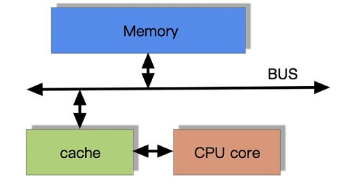

# CPU快取一致性協議MESI

## CPU為何要有快取記憶體?

CPU高速運算需要高速的資料存取。為解決這個問題，廠商在CPU中內建了少量的快取記憶體以解決I/O速度和CPU運算速度之間的不匹配問題。

## 區域性原理\(principle of locality\)

在CPU訪問儲存裝置時，無論是存取資料或存取指令，都趨於聚集在一片連續的區域中，這就被稱為區域性原理。

* 時間區域性性（Temporal Locality）：如果一個資訊項正在被訪問，那麼在近期它很可能還會被再次訪問。比如迴圈、遞迴、函數的反覆呼叫等。
* 空間區域性性（Spatial Locality）：如果一個變數的位置被引用，那麼將來他附近的位置也會被引用。比如順序執行的程式碼、連續建立的兩個物件、陣列等。

## 帶有快取記憶體的CPU執行計算的流程

1. 程式以及資料被載入到主記憶體
2. 指令和資料被載入到CPU的快取記憶體
3. CPU執行指令，把結果寫到快取記憶體
4. 快取記憶體中的資料寫回主記憶體

## 多核CPU多級快取一致性協議MESI

多核CPU的情況下有多個一級快取，如何保證快取內部資料的一致,不讓系統資料混亂。這裡就引出了一個一致性的協議MESI。

### MESI協議快取狀態

MESI 是指4種狀態的首字母。每個Cache line有4個狀態，可用2個bit表示，它們分別是：

* cache line：cache儲存資料的單元

| 狀態 | 描述 | 監聽任務 |
| :--- | :--- | :--- |
| M \(modified\) | 該cache line有效，資料被修改了，與記憶體中的資料不一致，資料只在本快取中。 |  |
| E \(exclusive\) | 該cache line有效，資料與記憶體中的資料一致，且資料只在本快取中。 |  |
| S \(shared\) | 該cache line有效，資料和記憶體中的資料一致，資料存在於很多快取中。 |  |
| I \(invalid\) | 該cache line無效。 |  |

