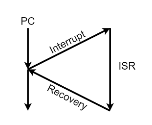
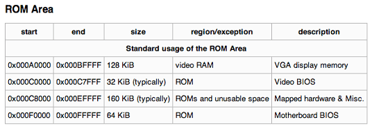

# 中斷(interrupt)

## 簡介

在8086開始，中斷向量表就佔據記憶體編號0的地址。這個0地址是虛擬地址而不是物理地址，在保護模式下0的虛擬地址訪問會產生一個異常，你是訪問不到物理0地址的。我們在內核模式使用一些技巧或者我們進入真實模式，才能看到它們。

每個中斷向量（vector）佔據4個位元組，Intel定義了256個向量，共用去1KB的記憶體空間。每個向量就是一個記憶體地址，指向該中斷（INT）處理函數的入口。

中斷向量（表）裡面的每一個元素都是一個中斷服務程式（interrupt service procedure）的地址。一台計算機有若干個層次的中斷處理系統。整個中斷向量表就是一個大函數指標表，一個中斷發生，CPU就來這裡查表，跳到相應地址就行了。

裸機無任何作業系統，只要有BIOS，就有BIOS中斷向量表，也叫硬體中斷向量表，這是IBM PC體系中最最低層，最接近硬體的中斷系統了，裸機寫程式可以用組合語言來調用BIOS中斷。

BIOS中斷系統的中斷向量表是BIOS通電以後BIOS ROM中的程序初始化的，初始化過程中主要是確定向量表的首地址，陣列長度，以及陣列中的內容，陣列中的內容都是記憶體地址，但是實際上這些記憶體地址所指向的服務程式碼都是在BIOS的ROM中的。

設計師可以至於通過記憶體地址訪問BIOS ROM程式碼，因為北橋晶片(後改為MCH記憶體控制中心)做了記憶體地址映射 。雖然是硬體中斷，但是也為程式設計師提供替換中斷向量表中的地址的能力，典型應用是BIOS 80H 中斷，這個中斷是主機板時鐘晶片組每隔1/18.2秒硬體自動觸發，然後調用你設置的中斷程式(即設計師寫的中斷程式為回調函式)。

DOS作業系統，除了底層的BIOS中斷系統，DOS也自己實現了一套中斷系統，所以在DOS中寫程式，既可以調用DOS中斷，也可以調用BIOS中斷，而DOS中斷系統中的大部分中斷服務程式都會調用底層的BIOS中斷。而且DOS中斷向量表在記憶體中緊接著BIOS中斷向量表的，初始化過程是在DOS系統的boot階段。

簡單的說，中斷向量表的每一元素，裡面存放的僅僅是一個記憶體地址，中斷發生時候，CPU執行流程立刻跳轉到目標地址，開始取址-譯碼-執行流水線。這裡可不是什麼函數指標，因為沒有任何調用約定，參數全部通過暫存器傳遞，至於怎麼傳，完全是根據中斷服務程序怎麼使用暫存器來傳的。

中斷的目的是為了分時多工的處理機制，沒有中斷就只能用批次(batch)處理的方式處理工作。

CPU在執行目前任務時，當有特別事件(event)發生時，CPU應當暫停正在執行的程式，轉向執行處理該事件的子程式；事件處理完畢後，恢復原來的狀態，再繼續執行原來的程式。這種對這些事件的處理模式，稱為程式中斷控制模式，簡稱中斷控制或中斷。

這種處理緊急事件的服務子程式稱為中斷子程式。這種引起中斷的事件稱為中斷源。這些事件包括磁碟、鍵盤等等輸入輸出裝置，異常錯誤的發生甚至另一個CPU的呼叫。

## 中斷處理機制

為了快速處理常見的中斷，作業系械給予一個表格，儲存中斷服務函式的進入點，如果有中斷發生，可以快速查表，找到要服務的函式，此表格稱之為中斷處理函式（Interrupt handler routine），通常都置於記憶體開始的地方。

* 每個中斷事件會提供一小段程式去服務此中斷，稱之為中斷服務常式（Interrupt Service Routine, ISR)）。
* 而中斷向量（Interrupt vector）是一個由00H 到FFH 的數字，用來判 斷中斷的種類。

### 優點&#xD;

相對於忙碌等待 (busy waiting)、輪詢 (polling) 有更好的效率，因為不需要額外的資源去確認是否有事件要處理，使用中斷可以專心於正在處理的事件，不需要時也可以進入休眠狀態節省資源，亦可實現分時多工、並行 (concurrency)
。

### &#xD;應用

* 協調 I/O，避免資料傳輸時 CPU被佔用
* 優雅結束錯誤並繼續執行正常流程
* 即時系統

## 中斷的種類

* 外部中斷(external interrupt): 又稱非同步中斷 (Asynchronous)， CPU 外的週邊元件所引起的。（I/O Complete Interrupt, I/O Device error）
* 內部中斷 (internal interrupt):又稱同步中斷 (Synchronous)，不合法的用法所引起的。（Debug, Divide-by-zero, overflow）
* Software Interrupt（軟體中斷）：使用者程式在執行時，若需要作業系統提供服務時，會藉由系統呼叫來呼叫作業系統執行對應的服務常式，完成任務請求後，再將結果傳回給使用者程式。

## BIOS中斷、DOS中斷、Linux中斷的區別?

BIOS 和DOS 都是存在於真實模式下的程式，它們建立的中斷呼叫都是建立在中斷向量表（Interrupt
&#x20;Vector Table, IVT）中的。它們都是通過軟中斷指令INT與中斷號碼來呼叫的。

中斷向量表中的每個中斷向量大小是4 位元組。這4 位元組描述了一個中斷處理常式（程式）的段基底地址和
段內偏移位址。因為中斷向量表的長度為1024 位元組，故該表最多容納256 個中斷向量處理常式。

**中斷向量表中第0H～1FH 項是BIOS 中斷**。BIOS 在填寫中斷向量表，那該表是誰創建的呢？答案就是CPU 原生支持的，不用誰負
責創建。
軟體中只要執行INT 中斷向量號，CPU 便會把向量號當作下標，去中斷向量表中定位中斷處理常式並執行。

電腦
啟動之初，中斷向量表中的中斷常式是由BIOS 建立的，它從實體記憶體地址0x0000 處初始化並在中斷向
量表中添加各種處理常式。

BIOS 中斷呼叫的主要功能是提供了硬體訪問的方法，該方法使對硬體的操作變得簡單易行。操作硬體無非是通過in/out 指令來讀寫外設的埠，BIOS 中斷程式處理是用來操作硬體的，故該處理常式中到處都是in/out 指令。

### BIOS 為什麼添加中斷處理常式？&#xD;

* 給自己用，因為BIOS 也是一段程式，是程式就很可能要重複性地執行某段程式碼，它直接將其寫
  成中斷函數直接呼值叫。
* 給後來的程式用，如載入器或boot loader。它們在調用硬體資源時就不需要自己重寫程式碼。

### 硬體自已的程式碼位於ROM中

硬體廠商為了讓自己生產的產品易用，事先寫好了一組呼叫介面，必然是越簡單越好，直接給介面函數傳一個參數，
硬體就能返回一個輸出。

每個外部設備，包括顯卡、鍵盤、各種控制器等，都有自己的記憶體（主機板也有自己的記憶體，BIOS 就存放
在裡面），不過這種記憶體都是唯讀記憶體ROM。
硬體自己的功能調用常式及初始化程式碼就存放在這ROM
中。

根據規範，**第1 個記憶體單元的內容是0x55，第2 個存儲單元是0xAA，第3 個存儲單位是該ROM 中以
512 位元組為單位的程式碼長度。從第4 個存儲單元起就是實際程式碼了**，直到第3 個存儲單元所示的長度為止。

### CPU訪問硬體的ROM的方法：記憶體映射與埠操作

* 記憶體映射：通過地址匯流排將外設自己的記憶體映射到某個記憶體區域（並不是映射到主機板上插的記憶體條中）。
  * 從記憶體的物理位址0xA0000 開始到0xFFFFF 這部分記憶體中，一部分是專門用來做映射的，如果硬體
    存在，硬體自己的ROM 會被映射到這片記憶體中的某處
    ，映射的工作由硬體自行完成。
  * BIOS 在執行期間會掃描0xC0000 到0xE0000 之間的記憶體，若在某個區域發現前兩個位元組是0x55 和0xAA 時，這意味著該區域對應的ROM中有程式碼存在，再對該區域做累加和檢查，若結果與第3個位元組的值相符，說明程式碼無誤，就從第4 個位元組進入。這時開始執行了硬體自帶的常式以初始化硬體自身，最後，BIOS 填寫中斷向量表中相關項，使它們指向硬體自帶的常式。

* 埠操作：外部設備都有自己的控制器，控制器上有暂存器，這些暂存器就是所謂的埠，通過in/out
  指令讀寫埠來訪問硬體的記憶體。

### DOS中斷

DOS 是執行在真實模式下的，故其建立的中斷調用也建立在中斷向量表中，只不過其中斷向量號和BIOS
的不能衝突。

0x20～0x27 是DOS 中斷。因為DOS 在真實模式下執行，故其可以調用BIOS 中斷。
DOS 中斷只佔用0x21 這個中斷號，也就是DOS 只有這一個中斷常式。

DOS 中斷調用是通過先往AJ 暂存器中寫好子功能號，再執行INT 0x21。
這時在中斷向量表中第0x21 個表項，即物理位址0x21\*4 處中的中斷處理常式開始根據暂存器AH中的值
來調用相應的子功能。

### Linux中斷

而 Linux 內核是在進入保護模式後才建立中斷常式的，不過在保護模式下，中斷向量表已經不存在了，取而代之的是中斷描述符表（Interrupt Descriptor Table, IDT）
。所以在Linux 下執行的中斷調用，訪問的中斷常式是在中斷描述符表中，已不在中斷向量表裡了。

Linux 的系統調用和DOS 中斷調用類似，不過Linux 是通過INT 0x80 指令進入一個中斷程式後再根據
EAX暂存器的值來調用不同的子功能函數的。

**如果在真實模式下執行INT指令，會自動去訪問
中斷向量表。如果在保護模式下執行INT指令，則會自動訪問中斷描述符表**。
