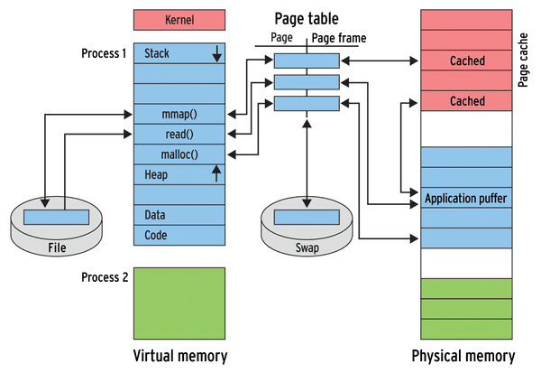
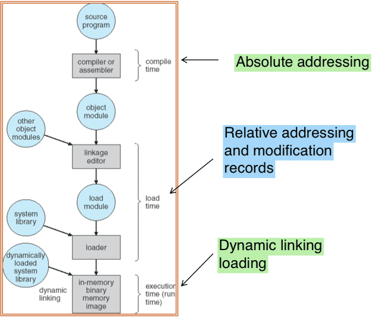

# 記憶體管理\(memory management\)

程式執行時，必須要從硬碟中取出，帶到記憶體內才可被執行。CPU能夠直接存取暫存器跟記憶體的內容。

記憶體地址分為兩類：

* 邏輯地址\(logical address\)：CPU所處理的地址，又叫做虛擬地址\(virtual address\)。
* 實體地址\(Physical address\)：記憶體上真實的位置\(經過memory unit處理過\)。

基底與限制暫存器\(Base and limit register\)，使用這兩個暫存器來定義邏輯地址空間\(logical address space\)，分別紀錄行程起始記憶體位置\(使用基底暫存器\)跟行程所佔記憶體位置大小\(使用限制暫存器\)。

## 地址的繫結\(address binding\)

繫結決定了程式起始地址，即程式要在記憶體的哪個地方開始執行。

繫結有 3 個時期如下：

*  編譯時期 \(Compile time\)：由編譯器決定，將來程式執行的起始位址不得變更。
  * 缺點：若所決定的位址內有其它的程式在執行，或之後要變更程式執行的起始位址，則須重新編譯。
* 載入時期 \(Load time\)：由連結器決定。在編譯時不會固定地址，因此生成可重定位地址\(relocatable address\)，不一定由固定位置執行。
  * 缺點：執行時間沒有被呼叫到的模組仍需事先 linking, Allocation, Loading，浪費時間也浪費記憶體。 \(e.g. if-else 的程序、OS 錯誤處理程序。\)
  * 程式執行期間仍不可以改變起始位址。
* 執行時期 \(Execution time\)：由OS動態決定。如果記憶體區段在執行時被移動，連結才會延到這個時期。這需要硬體MMU上的支援、彈性高，但執行慢效率差。

MMU \(Memory-Management Unit\) 是一種可將邏輯地址轉換成實體地址的硬體設備。基底暫存器在這就被稱為重定位暫存器\(relocation register\)。

