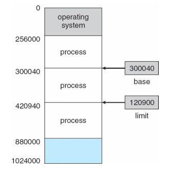
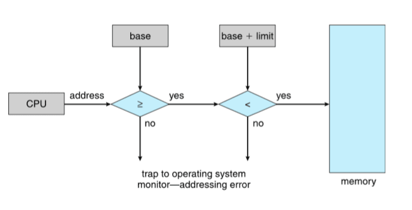

# 記憶體管理(memory management)

* 程式必須要被進主記憶體中（從硬碟中），並且放入行程中運行。
* 主記憶體以及暫存器是CPU唯二可以直接存取的儲存空間。
* 記憶體單元只能辨認位址流+讀取請求或寫入請求。
* 暫存器存取在一個CPU振盪（或更少）時間。
* 存取主記憶體可能需要很多周期，導致停頓。
* 快取被放在CPU暫存器以及主記憶體之間(L1, L2, L3 Cache)。
* 記憶體管理的目的是保護主記憶體以確保正確操作。

在保護模式中，有三種定址方式：邏輯位址（Logical Address）、線性位址（Linear Address）、和實體位址（Physical Address）。

對大部分的應用程式而言，幾乎只會用到邏輯地址。線性也址和實體地址在大部分的情形中，只有作業系統會使用。

* 邏輯地址(logical address)：CPU所處理的地址，又叫做虛擬地址(virtual address)。
* 實體地址(Physical address)：記憶體上真實的地址(經過MMU處理過)。32-bit系統中為系統的記憶體的真正位址，它的範圍由 00000000h 到 FFFFFFFFh，共有 4GB。
* 在沒有使用分頁（Paging）功能的時候，線性地址是直接對映到實體地址的，也就是說，線性地址就等同於實體地址。不過，在開啟分頁分能之後，一個線性地址可能沒有相對映的實體地址（因為它所對映的記憶體可能被 swap 到硬碟裡了）。

大部分情形中，系統的 RAM 都是由 00000000h 開始定址（即在最底端），而 ROM 則由 FFFFFFFFh 開始定址（即在最頂端）。這是因為在 RESET 之後，處理器會從定址空間的頂端開始執行，所以把 ROM 定址在頂端才能讓處理器在 RESET 後執行到開機用的程式（如開機自我測試之類的程式）。

## 記憶體訪問為何要分段(segment)?

目的：

* 「段基底地址+段內偏移位址」讓程式地址重定位。
* 段可在記憶體任意起始地址，即可在記憶體內任意位移。

分段是從8086 開始的，限於技術和經濟，那時候電腦成本非常昂貴，
所以CPU 和暫存器等寬度都是16 位元，即暫存器的可存儲的數位範圍
2^16=65536 bytes=64KB。當時的系統沒有虛擬地址只有物理地址，訪問任何存儲單元都直接給出物理位址。

編譯器在編譯程式時，必須根據CPU 訪問記憶體的規則將程式碼編譯成機器指令，這樣編譯出來的程式才能在該CPU 上執行。所以在直接以絕對物理地址訪問記憶體的CPU 上執行程式，該程式中指令的地址也必
須得是絕對物理地址。總之，要想在該硬體上執行，就要遵從該硬體的規則，作業系統和編譯器也無一例外。

若載入程式執行，不管其是內核程式，還是用戶程式，程式中的地址若都是絕對物理地址，那該程式必須放
在記憶體中固定的地方，於是，兩個編譯出來位址相同的用戶程式還真沒法同時執行，只能執行一個。**解決此問題的方式是讓CPU 採用「段基底地址+段內偏移位址」的方式來訪問任意記憶體**。這
樣的好處是程式可以重定位(relocation)，儘管程式指令中給的是絕對物理位址，但終究可以同時執行多個程式。

CPU 採用「段基底地址+段內偏移移址」的形式訪問記憶體，就需要專門提供段基址暂存器，這些是CS、DS、SS、ES 等。程式中需要用到哪塊記憶體，只要先載入合適的段到段基底地址暂存器中，再給出相對于該段基址的偏移
位址便可。CPU 中的位址單元會將這兩個位址相加後的結果用於記憶體訪問，送上地址匯流排。

注意，很多使用者都覺得段基底地址一定得是65536 的倍數（16 位元段基址暂存器的容量），這個真的不用，段基址可以是任意的。這就是段可以重疊的原因。

只要程式分了段，把整個段平移到任何位置後，段內的位址相對于段基
址是不變的，無論段基址是多少，只要給出段內偏移位址，CPU 就能訪問到正確的指令。於是載入用戶
程式時，只要將整個段的內容複製到新的位置，再將段基址暫存器中的位址改成該地址，程式便可準確無
誤地執行，

偏移地址也要存入暂存器，而那時的暂存器是16 位的，也就
是一個段最多可以訪問到64KB。而那時的記憶體再小也有1MB，
改變段基址，由一個段變為另一個段，就像一個段在記憶體中飄移，
採用這種在記憶體中來回挪位置的方式可以訪問到任意記憶體位置。

所以說，程式分段又是為了將大記憶體分成可以訪問的小段，
通過這樣變通的方法便能夠訪問到所有記憶體了。

## 平坦模型(flat model)

平坦模型是相對于多段模型來說的，所以說平坦模型指的就是一個段。

比如在真實模式下，因為暫存器只有16位元，但記憶體空間需20位元定址，訪問超過
64KB 的記憶體，需要重新指定不同的段基底地址，通過這種迂回變通的方式才能達到目的。

在保護模式下，
由於暫存器是32 位元，單一段偏移定址範圍便能夠達到4GB。在32
位元環境下用一個段就能夠訪問到硬體所支援的所有記憶體。也就是說，段的大小可以是地址匯流排能夠到達
的範圍。

既然平坦模型是相對于多段模型來說的，為什麼不稱為單段模型，而稱為平坦呢，我估計很多
讀者已經明白了，用多個小段再加上不斷換段基址的方式訪問記憶體確實夠麻煩的，可能換著換著就暈了。

別忘記了，這種多段模型為了訪問到1MB 位址空間，還需要額外打開A20 位址線呢，這種訪存方式本
身就是種補救措施，相當於給硬體打了個補丁，既然是補丁，訪問記憶體的過程必然是不順暢的。

相對於
那麼麻煩的多段模型，平坦模型不需要額外打開A20 位址線，不需要來回切換段基址就可以在位址空間
內任意移動。

## 段暫存器的位元寬度為何?

CPU 中存在於段暂存器是因為其記憶體是分段訪問的。CPU 內部的段暂存器如下：

* CS (code segment)：其值為程式碼段的段基底地址。
* DS (data segment)：其值為資料段的段基底地址。
* ES (extra segment)：其值為附加資料段的段基底地址。附加是指資料不固定，可任意使用。
* FS (extra segment)：同上，其值為附加資料段的段基底地址。
* GS (extra segment)：同上，其值為附加資料段的段基底地址。
* SS (stack segment)：其值為堆疊段的段基底地址。

16位元的CPU只有真實模式，而32位元的CPU有真實模式和保護模式。兩種模式下，段暫存器中之值意義不同，但都是指向段在記憶體的位址。

真實模式中，CS、DS、ES、SS中之值為段的基底地址，為具體的物理地址，記憶體單元的邏輯地址是「段基底地址：段內偏移量」的形式。

保護模式下，段暫存器中存放的不是段基底地址，而是段選擇子(segment selector)，其值仍為16位元。

所以在32 位CPU 中，段暫存器無論是工作在16 位的真實模式，還是32 位元的保護模式，用的段暂存器都
是同一組，並且在32 位下的段選擇子是16 位寬度
。

## 基底與限制暫存器(base and limit registers)

基底與限制暫存器是用來定義邏輯地址空間(logical address space)，分別紀錄行程起始記憶體位置(使用基底暫存器)跟行程所佔記憶體位置大小(使用限制暫存器)。

CPU必須確認每一個來自使用者空間的記憶體操作，都坐落在基底以及限制暫存器的值之間。

## 地址的繫結(address binding)

繫結決定了程式起始地址，即程式要在記憶體的哪個地方開始執行。

繫結有 3 個時期如下：

*
  編譯時期 (Compile time)：由編譯器決定，將來程式執行的起始位址不得變更。
  * 缺點：若所決定的位址內有其它的程式在執行，或之後要變更程式執行的起始位址，則須重新編譯。
* 載入時期 (Load time)：由連結器決定。在編譯時不會固定地址，因此生成可重定位地址(relocatable address)，不一定由固定位置執行。
  * 缺點：執行時間沒有被呼叫到的模組仍需事先 linking, Allocation, Loading，浪費時間也浪費記憶體。 (e.g. if-else 的程序、OS 錯誤處理程序。)
  * 程式執行期間仍不可以改變起始位址。
* 執行時期 (Execution time)：由OS動態決定。如果記憶體區段在執行時被移動，連結才會延到這個時期。這需要硬體MMU上的支援、彈性高，但執行慢效率差。

MMU (Memory-Management Unit) 是一種可將邏輯地址轉換成實體地址的硬體設備。基底暫存器在這就被稱為重定位暫存器(relocation register)。

