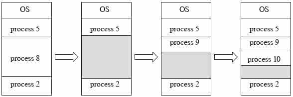
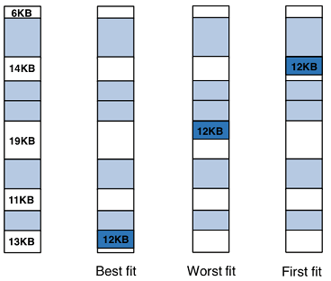

# 連續記憶體分配(contiguous memory allocation)

主記憶體通常會有兩個分區

* 常駐作業系統，通常會放在較低位址的記憶體區塊，帶有中斷向量。
* 使用者行程，通常會放在比較高位址的記憶體區塊。

## 多分區分配(Multiple-partition allocation)

* 固定分區大小(Fixed-partition)：除非Process需求的大小剛好等於每分區大小的倍數，不然通常都會多給。
* 變動區塊大小(Variable-partition): 滿足Process的需求，要多少給多少。
* 洞(hole): 一塊連續記憶體。
  多個大小不同的洞，會分散在記憶體之中。

行程要放入記憶體中時，會被分配在大小足夠容納的洞中。作業系統維護已分配的區域，還有尚未被分配的區域（洞）。

## 動態儲存分區問題(Dynamic Storage-Allocation Problem)

Q: 如何滿足大小為n的行程進入記憶體？

* First-fit：分配第一個大小滿足條件(>=n)的洞給行程。
* Best-fit：分配第一個最小剛好滿足的洞給行程。
  必須搜尋整個洞的列表，除非列表已經依照大小排列。
* Worst-fit：分配最大的洞給行程。也必須搜尋整個洞的列表。

在速度以及空間利用率方面，first-fit跟best-fit好過於worst-fit。

碎裂(Fragmentation)

|      | 內部碎裂                                                                            | 外部碎裂                                               |
| ---- | ------------------------------------------------------------------------------- | -------------------------------------------------- |
| 定義   | 分配給行程的閒置記憶體空間，稍微大於行程所需求記憶體空間，多餘的部份並沒有被使用。如行程需要3MB的空間，但分配給行程4MB的空間，有1MB的空間沒有被使用。 | 剩餘的記憶體空間(洞)能夠滿足新的行程空間需求，但是因為洞不連續，仍舊無法配置給新的行程。      |
| 發生原因 | 將固定尺寸的記憶體空間配置給行程                                                                | 將尺寸可變動的記憶體空間配置給行程                                  |
| 發生時機 | 當配置的記憶體空間大於行程所需空間時發生                                                            | 當行程結束移出主記憶體時發生                                     |
| 解法   | 採用best-fit配置策略                                                                  | 聚集閒置的記憶體空間(compaction)，分頁(paging)與分段(segmentation) |

