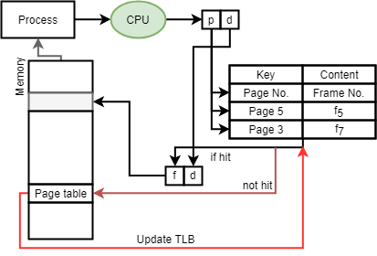

# 分頁\(paging\)

所謂的分頁功能，是指把定址空間分割成許多頁，而實際的記憶體可能無法容納這麼多頁，因此有些頁若暫時沒有用到，就可以暫時存放到硬碟（或其它儲存媒體）中，等到需要的時候再取出來。這個功能可以讓系統使用比實際的記憶體空間更大的記憶體。

因此，在這種情形下，一個線性位址所在的頁可能還在硬碟中。要存取這個地址，就要先把置換\(swap\)到硬碟中的資料取出，放到實體記憶體中的某個位置中（這時，可能有些頁就得讓開位置，被 置換到硬碟中了）。

當分頁功能開啟時，線性記憶體就不是直接對映到實體記憶體上了。線性記憶空間會分割成許多固定大小的頁（Pages），通常是 4KB。

## 分頁表\(page table\)

## TLB \( Translation lookasdie buffer \) 加速

使用 TLB \( Translation lookasdie buffer \) 暫存器 \( or Associative register \) 保存分頁表中經常被存取之分頁編號與頁框編號，而完整的分頁表還是置於記憶體之中。

## 小結

* 使用者看到的還是連續性的\(邏輯\)記憶體，但實際上是分散
  在實體記憶體中。
* 作業系統為每個行程維持一個分頁表。
* 作業系統維持框架表\(frame table\)管理實體記憶。
* 每個框架表有自己的實體。
  * 框架表記錄框架是free還是allocated
    。
  * 實體記錄 " pid " 和 " page number "

