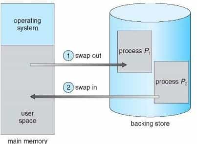

# 記憶體置換\(memory swapping\)

在程式執行時，行程有時會需要暫時離開記憶體，之後會再搬回來執行，此過程稱為置換\(swapping\)，搬入搬出記憶體的動作我們稱為swap out跟swap in。而在這裡的硬碟我們會將它稱作backing store，兩者是互通的。

置換在實作時，必需考量搬回記憶體時是否還能在同樣的位置，這就要看程式繫結\(binding method\)的作法。但其實置換是一件很耗費計算資源的工作，所以一定是到記憶體無法負荷時才會使用。在早期置換是很重要的記憶體管理議題，但現在多用虛擬記憶體來處理。

上下文交換\(context switch\)和置換有什麼差別？置換是行程在記憶體搬進搬出，而上下文切換是兩個行程在轉換資訊的過程。

舉例來說，當現在CPU處理行程A到一半時，要切換到另外一個行程B，這時若行程B不在記憶體內，就要將行程B置換進來，然後再和行程A進行上下文切換，但這裡上下文切換的時間就會被拉長，因為還要把一個行程A搬出去，再把行程B一個搬進來。這時我們可以運用系統呼叫來判斷記憶體是否有足夠的空間能直接把行程B直接拉進來，不用一個換一個，浪費時間。

而置換還會遇到一個問題，如果他要移除正在執行的Ｉ/Ｏ呢？有三個選擇：

* 不將其swap out，而讓它繼續執行
* 就把它swap out，不做Ｉ/Ｏ了
* 交給kernel來做\(在記憶體內搬來搬去\)，但是會造成double buffering，有overhead的可能性存在\(這是最常用的方法\)

