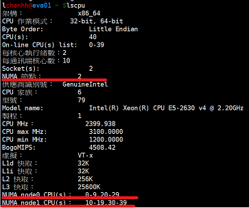

# NUMA架構

NUMA(non-uniform memory access)架構

NUMA架構在多個CPU系統中才有明顯的問題。Linux中可用`lscpu`指令看numa節點的個數，2個(含)以上才有numa的架構，單CPU多核的的numa節點個數為1。

為什麼要有NUMA

在NUMA架構出現前，CPU朝著頻率越來越高的方向發展。受到物理極限的挑戰，又轉為核數越來越多的方向發展。

由於所有CPU核都是通過共享一個北橋來讀取記憶體，隨著核數如何的發展，北橋在響應時間上的效能瓶頸越來越明顯。於是，聰明的硬體設計師們，先到了把記憶體控制器（原本北橋中讀取記憶體的部分）也做個拆分，平分到了每個晶片上。於是NUMA就出現了。

CPU訪問自己晶片上所插的記憶體時速度快，而訪問其他CPU所關聯的記憶體（remote access）的速度相較慢三倍左右。

## NUMA是什麼?

NUMA中，雖然記憶體直接attach在CPU上，但是由於記憶體被平均分配在了各個晶片上。只有當CPU訪問自身直接attach記憶體對應的實體地址時，才會有較短的響應時間（後稱Local Access）。而如果需要訪問其他CPU attach的記憶體的資料時，就需要通過inter-connect通道訪問，響應時間就相比之前變慢了（後稱Remote Access）。所以NUMA（Non-Uniform Memory Access）就此得名。

我們需要為NUMA做什麼?

對於NUMA架構需要哪些優化？下面這點是顯而易見的：

* CPU只有資料在local access時響應時間才能有保障，那麼我們就儘量把該CPU所要的資料集中在他local的記憶體中。

沒錯，事實上Linux識別到NUMA架構後，預設的記憶體分配方案就是：優先嘗試在請求執行當前所處的CPU的Local記憶體上分配空間。如果local記憶體不足，優先淘汰local記憶體中無用的Page（Inactive，Unmapped）。&#x20;

### NUMA的問題

幾乎所有的運維都會多多少少都有NUMA的問題如下：

* MySQL – The MySQL 「swap insanity」 problem and the effects of the NUMA architecture
* PostgreSQL – PostgreSQL, NUMA and zone reclaim mode on linux
* Oracle – Non-Uniform Memory Access (NUMA) architecture with Oracle database by examples
* Java – Optimizing Linux Memory Management for Low-latency / High-throughput Databases

究其原因幾乎都和：「因為CPU親和策略導致的記憶體分配不平均」及「NUMA Zone Claim記憶體回收」有關。

Linux核心預設使用CPU親和的記憶體分配策略，使記憶體頁儘可能的和呼叫執行處在同一個Core/Chip中。	 由於記憶體頁沒有動態調整策略，使得大部分記憶體頁都集中在CPU 0上。	• 又因為Reclaim預設策略優先淘汰/Swap本Chip上的記憶體，使得大量有用記憶體被換出當被換出頁被訪問時問題就以資料庫響應時間飆高甚至阻塞的形式出現了。
